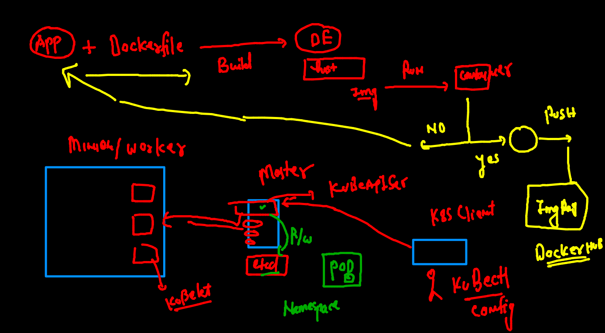

# oracle13thsept2021

## training plan 


##  day3 revision 



## cleaning up namespace pods 

```
 fire@ashutoshhs-MacBook-Air  ~  kubectl  config get-contexts 
CURRENT   NAME                          CLUSTER      AUTHINFO           NAMESPACE
*         kubernetes-admin@kubernetes   kubernetes   kubernetes-admin   ashu-space
 fire@ashutoshhs-MacBook-Air  ~  kubectl  get  po 
NAME         READY   STATUS    RESTARTS   AGE
ashupod2     1/1     Running   0          18h
ashuwebpod   1/1     Running   0          18h
 fire@ashutoshhs-MacBook-Air  ~  kubectl  delete  pods --all
pod "ashupod2" deleted
pod "ashuwebpod" deleted

```


