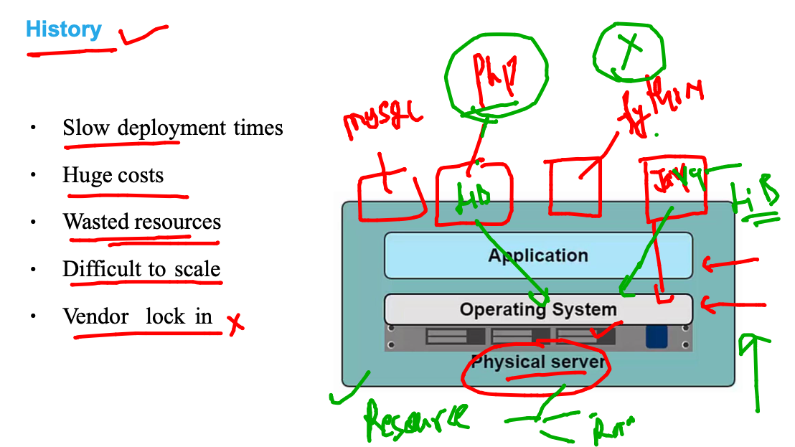
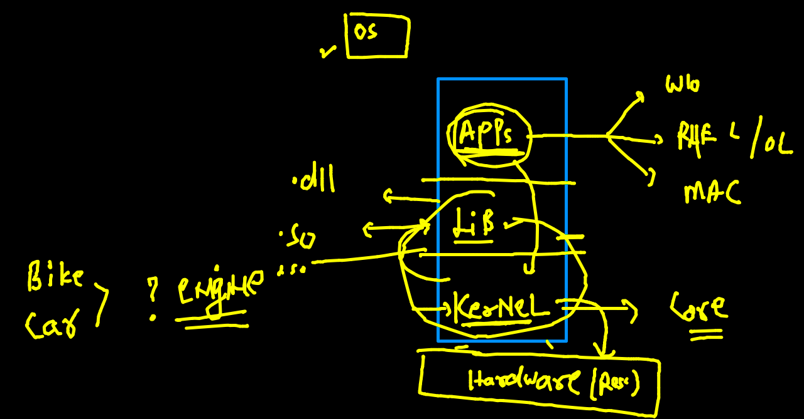
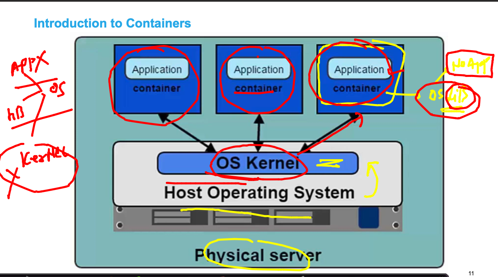
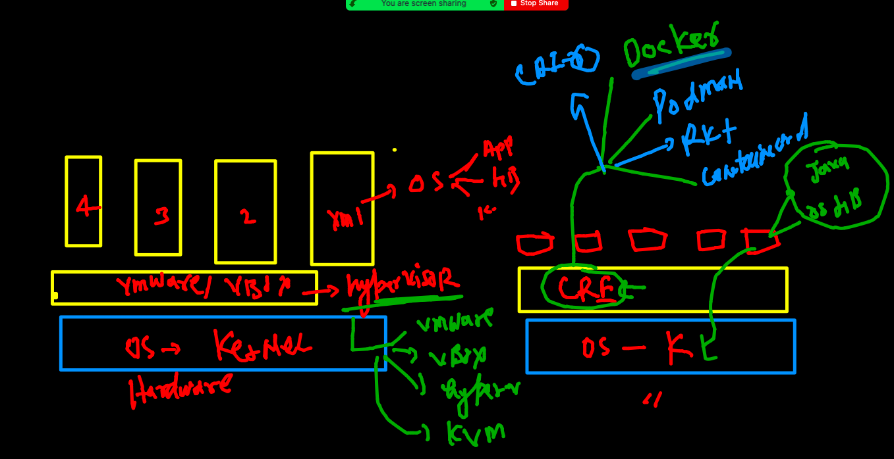
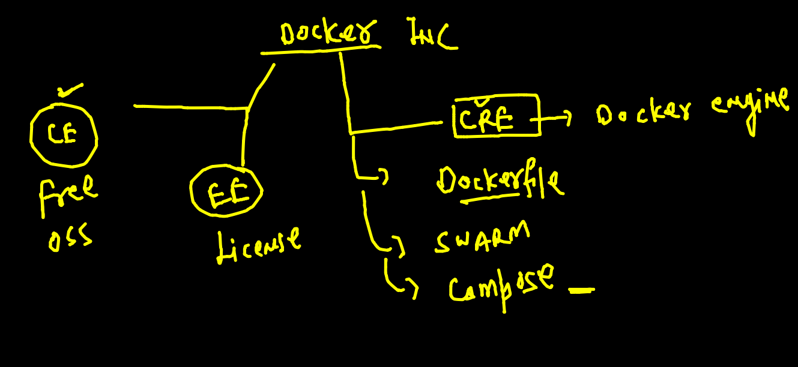
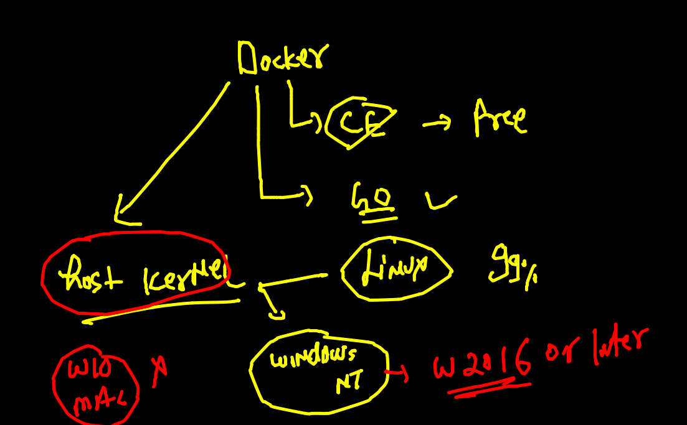

# oracle13thsept2021

## training plan 

## app deploy and testing problem with bare-metal 

## Understanding kernel the os part 

## Intro to container 

### Hypervisor vs CRE (container runtime engine)

### Intro to docker 

## Docker info two 

### Intro to docker desktop 

