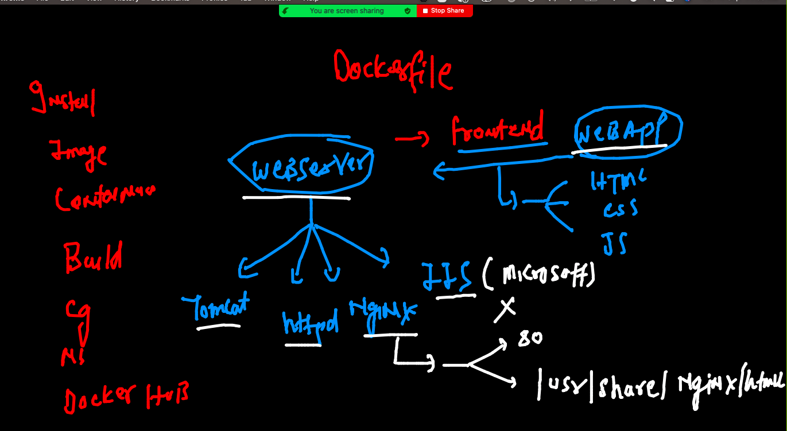
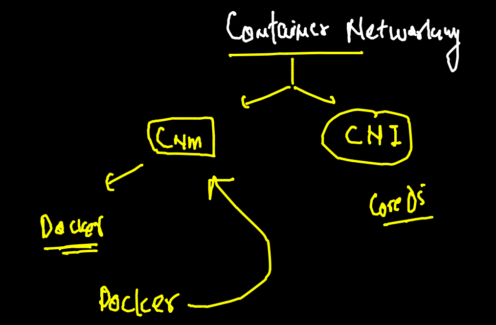
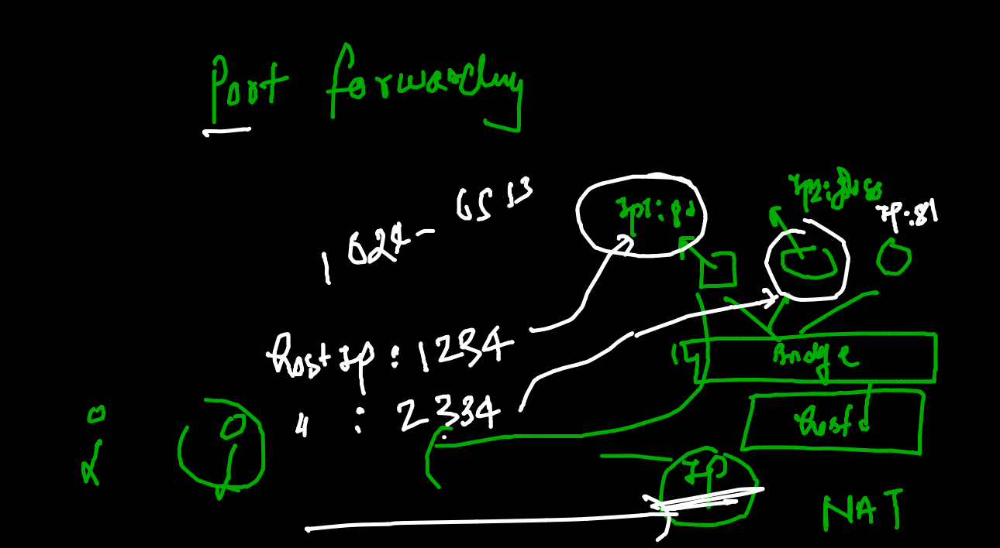

# oracle13thsept2021

## training plan 


## Day 1 revision 


## Namespace overview 


## cgroups 


## Cgroups 

### creating container

```
[ashu@ip-172-31-5-127 myimages]$ docker  run  -itd --name ashuc1  alpine  ping fb.com 
88982bbcaed91a3010a1ab59c9f9d16f3602aadd5c946738c2e5b9b18e793246
[ashu@ip-172-31-5-127 myimages]$ docker  ps
CONTAINER ID   IMAGE     COMMAND         CREATED          STATUS          PORTS     NAMES
88982bbcaed9   alpine    "ping fb.com"   19 seconds ago   Up 17 seconds             ashuc1

```

### apply cgroups 

```
 149  docker  run  -itd --name ashuc1  --memory 100m     alpine  ping fb.com 
  150  docker  run  -itd --name ashuc2  --memory 100m  --cpu-shares=20   alpine  ping fb.com 
  
```

## restart policy check 

```
[ashu@ip-172-31-5-127 myimages]$ docker  inspect  ashuc1  --format='{{.Id}}'
0874c9d2672a5df9da0d9cab15fc430094199dc2158d20d440df3d9fa642981a
[ashu@ip-172-31-5-127 myimages]$ 
[ashu@ip-172-31-5-127 myimages]$ docker  inspect  ashuc1  --format='{{.State.Status}}'
running
[ashu@ip-172-31-5-127 myimages]$ 
[ashu@ip-172-31-5-127 myimages]$ 
[ashu@ip-172-31-5-127 myimages]$ docker  inspect  ashuc1  --format='{{.HostConfig.RestartPolicy.Name}}'
no

```

### type fo restart policy 


```
 docker run -itd --name check1 --restart always  alpine ping fb.com 
 
```
### webapp containerization 

###  websevers 



### nginx web app containerization 

```
git clone https://github.com/mdn/beginner-html-site-styled

```

### building docker image

```
[ashu@ip-172-31-5-127 beginner-html-site-styled]$ docker  build -t  nginx:oracle14spet2021 .
Sending build context to Docker daemon  63.49kB
Step 1/3 : FROM nginx
 ---> ad4c705f24d3
Step 2/3 : LABEL email=ashutoshh@linux.com
 ---> Running in 764f691051c6
Removing intermediate container 764f691051c6
 ---> 0ec2fb8cf2b8
Step 3/3 : COPY . /usr/share/nginx/html/
 ---> 5cfc227811d4
Successfully built 5cfc227811d4
Successfully tagged nginx:oracle14spet2021

```

### creating container 

```
 docker  run -itd --name ashuweb  -p 2233:80  nginx:oracle14spet2021 
7fb1c1bfb74b6bcfb0f5f1f1471fbb15f1b19db78daa9ab770c97dd6b85b3170

```

## COntainer Networking 

### models 



### docker netowrking diagram 


### Docker check networking 

```
ashu@ip-172-31-5-127 beginner-html-site-styled]$ docker  network  ls
NETWORK ID     NAME      DRIVER    SCOPE
8f4044c8ba83   bridge    bridge    local
b0976616d56c   host      host      local
ce3c99056ff0   none      null      local

```

### checking networking 
```
ashu@ip-172-31-5-127 beginner-html-site-styled]$ docker  network inspect  8f4044c8ba83
[
    {
        "Name": "bridge",
        "Id": "8f4044c8ba83e6aea9fdaca1dcf64e867d4ab7f0f602fee93c3303408fc8e269",
        "Created": "2021-09-14T05:12:16.712123803Z",
        "Scope": "local",
        "Driver": "bridge",
        "EnableIPv6": false,
        "IPAM": {
            "Driver": "default",
            "Options": null,
            "Config": [
                {
                    "Subnet": "172.17.0.0/16",
                    "Gateway": "172.17.0.1"
                }
            ]
        },
        "Internal": false,
        "Attachable": false,
        
        
        ```
        
   ### COntainer IP address 
   
   ```
   
   ``
   
 ### Checking NAT 
 
 ```
 [ashu@ip-172-31-5-127 beginner-html-site-styled]$ docker  exec  -it  ashuc2  sh
/ # 
/ # ping google.com
PING google.com (142.251.33.206): 56 data bytes
64 bytes from 142.251.33.206: seq=0 ttl=111 time=1.125 ms
64 bytes from 142.251.33.206: seq=1 ttl=111 time=1.175 ms
64 bytes from 142.251.33.206: seq=2 ttl=111 time=1.106 ms
^C
--- google.com ping statistics ---
3 packets transmitted, 3 packets received, 0% packet loss
round-trip min/avg/max = 1.106/1.135/1.175 ms
/ # exit


```

### port wordarig 



### None bridge 

```
[ashu@ip-172-31-5-127 beginner-html-site-styled]$ docker  run -it --rm  --network  none alpine sh 
/ # 
/ # 
/ # ping  172.17.0.2
PING 172.17.0.2 (172.17.0.2): 56 data bytes
ping: sendto: Network unreachable
/ # 
/ # ping  google.com 
ping: bad address 'google.com'
/ # exit

```

### Host bridge usage 

```
 docker  run -it --rm  --network  host  alpine sh 
 
```

### creating network bridge 

```
ashu@ip-172-31-5-127 beginner-html-site-styled]$ docker  network   create  ashubr1
6a987d7ca7c363c1c71c38876de7bf14d196f855f517e6f263b82eb142476e81
[ashu@ip-172-31-5-127 beginner-html-site-styled]$ docker  network  ls
NETWORK ID     NAME      DRIVER    SCOPE
6a987d7ca7c3   ashubr1   bridge    local
8f4044c8ba83   bridge    bridge    local
b0976616d56c   host      host      local
ce3c99056ff0   none      null      local
[ashu@ip-172-31-5-127 beginner-html-site-styled]$ docker network  inspect  ashubr1
[
    {
        "Name": "ashubr1",
        "Id": "6a987d7ca7c363c1c71c38876de7bf14d196f855f517e6f263b82eb142476e81",
        "Created": "2021-09-14T07:13:37.840567804Z",
        "Scope": "local",
        "Driver": "bridge",
        "EnableIPv6": false,
        "IPAM": {
            "Driver": "default",
            "Options": {},
            "Config": [
                {
                    "Subnet": "172.18.0.0/16",
                    "Gateway": "172.18.0.1"
                }
            ]
        },
        "Internal": false,
        "Attachable": false,
        "Ingress": false,
        "ConfigFrom": {
            "Network": ""
        },
        "ConfigOnly": false,
        "Containers": {},
        "Options": {},
        "Labels": {}
    }
    
  ```
  
  ### custom bridge DNS is working 
  
  ```
  [ashu@ip-172-31-5-127 beginner-html-site-styled]$ docker  run -itd --name  ashux2  --network ashubr1 alpine sh 
7d86ff8d93c5aa6c8634028fb4e9f4a6d7b6b20377e00747c5dfe8e383196752

[ashu@ip-172-31-5-127 beginner-html-site-styled]$ 
[ashu@ip-172-31-5-127 beginner-html-site-styled]$ docker  run -itd --name  ashux3  --network ashubr1 alpine sh 
11f0e435cb44dfc8a6120ef69dbb265528865b0aa7c9d5e5d19d573152d13e01
[ashu@ip-172-31-5-127 beginner-html-site-styled]$ 
[ashu@ip-172-31-5-127 beginner-html-site-styled]$ docker  exec -it  ashux2 sh 
/ # 
/ # 
/ # ping  ashux3
PING ashux3 (172.18.0.3): 56 data bytes
64 bytes from 172.18.0.3: seq=0 ttl=255 time=0.111 ms
64 bytes from 172.18.0.3: seq=1 ttl=255 time=0.098 ms
^C
--- ashux3 ping statistics ---
2 packets transmitted, 2 packets received, 0% packet loss
round-trip min/avg/max = 0.098/0.104/0.111 ms
/ # exit

```

### custom bridge

```
[ashu@ip-172-31-5-127 beginner-html-site-styled]$ docker  network  create  ashubr2  --subnet 192.168.1.0/24 
2d18e9d653d4958c72adae3de8ab3b1b6e1c1e1a27d1f5f3c8897976d7d4db46
[ashu@ip-172-31-5-127 beginner-html-site-styled]$ docker  run -itd --name  ashuxx22  --network  ashubr2  alpine sh 
137d9b169b7fe4fdf209fdb67affd954abbe4ee303f576224d53f82ab3e17a0d
[ashu@ip-172-31-5-127 beginner-html-site-styled]$ docker  run -itd --name  ashuxx33   --network  ashubr2 --ip   192.168.1.100  alpine sh 
ac04e1daaa3474c295ccad0917fd9fdfdecc6a5a954b73191f58252088ece120
[ashu@ip-172-31-5-127 beginner-html-site-styled]$ docker  exec -it  ashuxx22 sh 
/ # ping ashuxx33
PING ashuxx33 (192.168.1.100): 56 data bytes
64 bytes from 192.168.1.100: seq=0 ttl=255 time=0.107 ms
64 bytes from 192.168.1.100: seq=1 ttl=255 time=0.086 ms
^C
--- ashuxx33 ping statistics ---
2 packets transmitted, 2 packets received, 0% packet loss
round-trip min/avg/max = 0.086/0.096/0.107 ms
/ # exit

```


