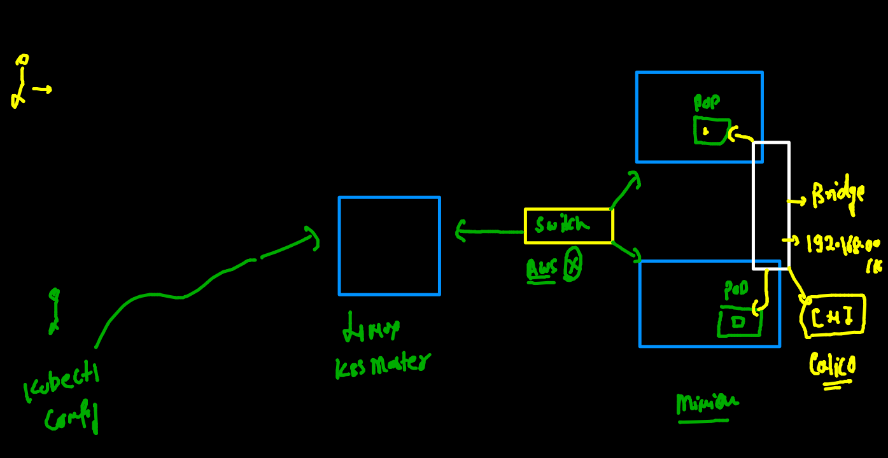
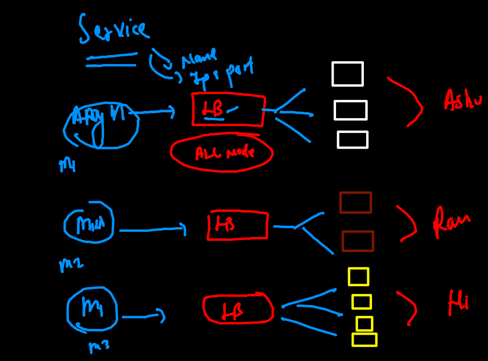
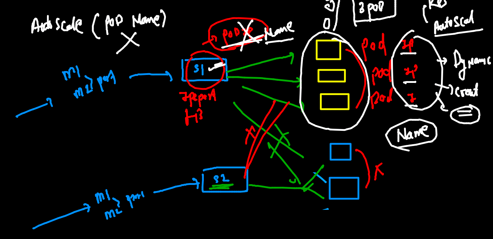
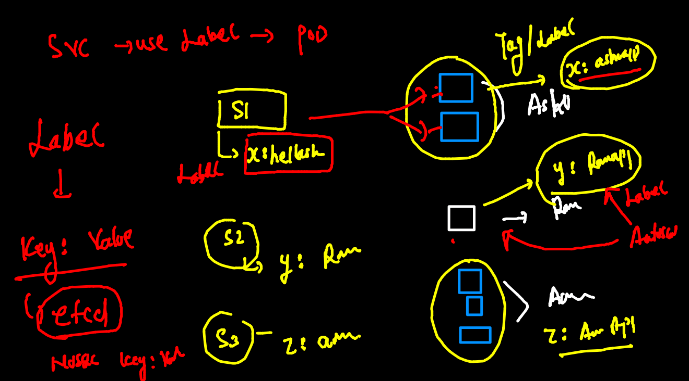
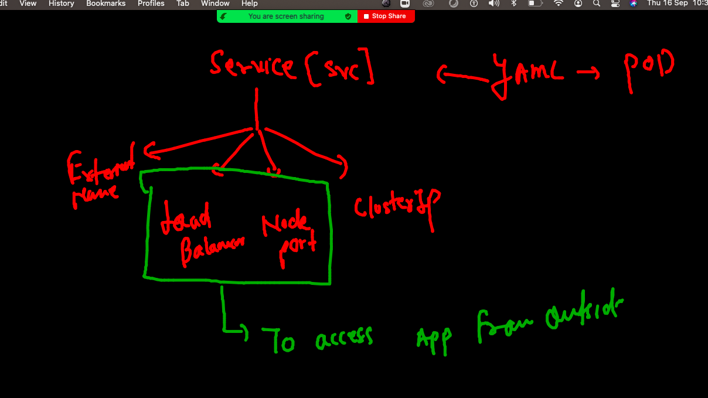
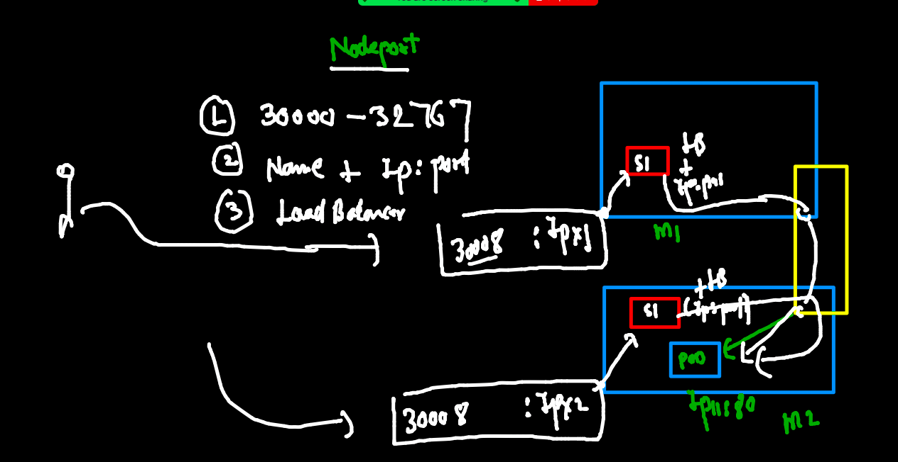
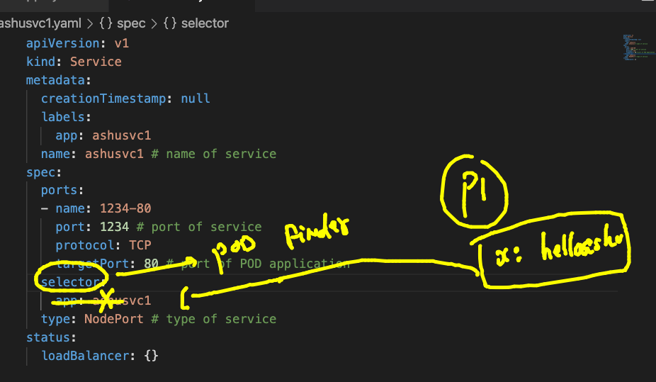

# oracle13thsept2021

## training plan 


##  day3 revision 


## cleaning up namespace pods 

```
 fire@ashutoshhs-MacBook-Air  ~  kubectl  config get-contexts 
CURRENT   NAME                          CLUSTER      AUTHINFO           NAMESPACE
*         kubernetes-admin@kubernetes   kubernetes   kubernetes-admin   ashu-space
 fire@ashutoshhs-MacBook-Air  ~  kubectl  get  po 
NAME         READY   STATUS    RESTARTS   AGE
ashupod2     1/1     Running   0          18h
ashuwebpod   1/1     Running   0          18h
 fire@ashutoshhs-MacBook-Air  ~  kubectl  delete  pods --all
pod "ashupod2" deleted
pod "ashuwebpod" deleted

```


## K8s Pod Networking 

### list of CNI 

[CNI URL](https://github.com/containernetworking/cni)

### POd networking L1



### deploying pod with ENV var 

```
fire@ashutoshhs-MacBook-Air  ~/Desktop/k8sapps  kubectl  run  ashuapp3  --image=dockerashu/httpd:orweb14sept2021  --port 80  --dry-run=client -o yaml 
apiVersion: v1
kind: Pod
metadata:
  creationTimestamp: null
  labels:
    run: ashuapp3
  name: ashuapp3
spec:
  containers:
  - image: dockerashu/httpd:orweb14sept2021
    name: ashuapp3
    ports:
    - containerPort: 80
    resources: {}
  dnsPolicy: ClusterFirst
  restartPolicy: Always
status: {}
 fire@ashutoshhs-MacBook-Air  ~/Desktop/k8sapps  kubectl  run  ashuapp3  --image=dockerashu/httpd:orweb14sept2021  --port 80  --dry-run=client -o yaml  >ashuapp3.yaml 
 
 ```
 
 ### Deploying pod 
 
 ```
 fire@ashutoshhs-MacBook-Air  ~/Desktop/k8sapps  kubectl  apply -f  ashuapp3.yaml 
pod/ashuapp3 created
 fire@ashutoshhs-MacBook-Air  ~/Desktop/k8sapps  kubectl  get  po 
NAME       READY   STATUS    RESTARTS   AGE
ashuapp3   1/1     Running   0          8s
 fire@ashutoshhs-MacBook-Air  ~/Desktop/k8sapps  kubectl  get  po  -o wide
NAME       READY   STATUS    RESTARTS   AGE   IP                NODE      NOMINATED NODE   READINESS GATES
ashuapp3   1/1     Running   0          14s   192.168.179.230   minion2   <none>           <none>
 fire@ashutoshhs-MacBook-Air  ~/Desktop/k8sapps  
 
```

## access pod app 

### case 1 from k8s client machine 
```
fire@ashutoshhs-MacBook-Air  ~/Desktop/k8sapps  kubectl  port-forward   ashuapp3  1234:80 
Forwarding from 127.0.0.1:1234 -> 80
Forwarding from [::1]:1234 -> 80
Handling connection for 1234
Handling connection for 1234
Handling connection for 1234
Handling connection for 1234
Handling connection for 1234
Handling connection for 1234
Handling connection for 1234

```

### case 2 as end user 

### Understanding and creating service 



### service can not use ip or name of pod to forward traffic 



### service will use label to find pod 



## type of service 




## Nodeport 



### checking label of POd

```
fire@ashutoshhs-MacBook-Air  ~/Desktop/k8sapps  kubectl  get  po  --show-labels 
NAME       READY   STATUS    RESTARTS   AGE   LABELS
ashuapp3   1/1     Running   0          42m   x=helloashuapp3

```

### Nodeport creation of service 

```
fire@ashutoshhs-MacBook-Air  ~/Desktop/k8sapps  kubectl  create   service  
Create a service using specified subcommand.

Aliases:
service, svc

Available Commands:
  clusterip    Create a ClusterIP service.
  externalname Create an ExternalName service.
  loadbalancer Create a LoadBalancer service.
  nodeport     Create a NodePort service.

Usage:


===


```

### creating service 

```
fire@ashutoshhs-MacBook-Air  ~/Desktop/k8sapps  kubectl  create   service   nodeport  ashusvc1  --tcp  1234:80  --dry-run=client  -o yaml 
apiVersion: v1
kind: Service
metadata:
  creationTimestamp: null
  labels:
    app: ashusvc1
  name: ashusvc1
spec:
  ports:
  - name: 1234-80
    port: 1234
    protocol: TCP
    targetPort: 80
  selector:
    app: ashusvc1
  type: NodePort
status:
  loadBalancer: {}
 fire@ashutoshhs-MacBook-Air  ~/Desktop/k8sapps  kubectl  create   service   nodeport  ashusvc1  --tcp  1234:80  --dry-run=client  -o yaml   >ashusvc1.yaml 
 
 ```
 
 ### matching label of POD to service selector 
 
 
 
 ### deploy service
 
 ```
  fire@ashutoshhs-MacBook-Air  ~/Desktop/k8sapps  kubectl  apply -f  ashusvc1.yaml 
service/ashusvc1 created
 fire@ashutoshhs-MacBook-Air  ~/Desktop/k8sapps  kubectl  get  service
NAME       TYPE       CLUSTER-IP    EXTERNAL-IP   PORT(S)          AGE
ashusvc1   NodePort   10.104.0.62   <none>        1234:32468/TCP   8s
 fire@ashutoshhs-MacBook-Air  ~/Desktop/k8sapps  kubectl  get  svc    
NAME       TYPE       CLUSTER-IP    EXTERNAL-IP   PORT(S)          AGE
ashusvc1   NodePort   10.104.0.62   <none>        1234:32468/TCP   12s

```

