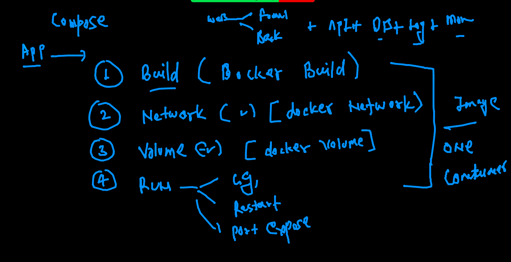
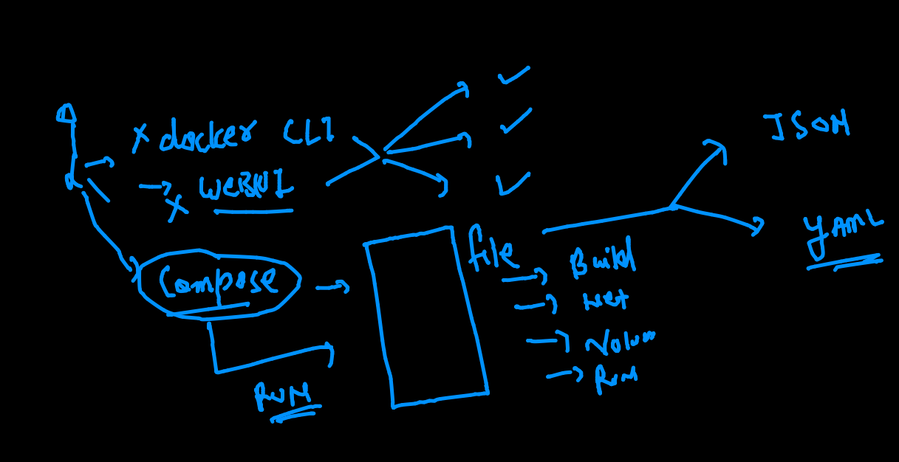

# oracle13thsept2021

## training plan 


## Revision of 2 days 


## Intro to docker. compose 



## more about docker compose 



## Installing docker-compose on CLient side 

[Install](https://docs.docker.com/compose/install/)

### checking installation 

```
[ashu@ip-172-31-5-127 myimages]$ docker-compose -v
docker-compose version 1.29.2, build 5becea4c

```

## Compose example 1 

```
[ashu@ip-172-31-5-127 myimages]$ ls
ashucompose  customer1  pythonapp  ubuntuimg  webapp
[ashu@ip-172-31-5-127 myimages]$ cd  ashucompose/
[ashu@ip-172-31-5-127 ashucompose]$ ls
docker-compose.yaml
[ashu@ip-172-31-5-127 ashucompose]$ docker-compose up  -d  
Creating network "ashucompose_default" with the default driver
Pulling ashuapp1 (alpine:)...
latest: Pulling from library/alpine
a0d0a0d46f8b: Downloading [>                                                  ]   41.3kB/2.814Ma0d0a0d46f8b: Pull complete
Digest: sha256:e1c082e3d3c45cccac829840a25941e679c25d438cc8412c2fa221cf1a824e6a
Status: Downloaded newer image for alpine:latest
Creating ashuc1 ... done

```

### more compose operations 

```
[ashu@ip-172-31-5-127 ashucompose]$ docker-compose ps 
 Name      Command     State   Ports
------------------------------------
ashuc1   ping fb.com   Up      

```

### 

```
[ashu@ip-172-31-5-127 ashucompose]$ docker-compose  stop 
Stopping ashuc1 ... done
[ashu@ip-172-31-5-127 ashucompose]$ docker-compose  ps
 Name      Command      State     Ports
---------------------------------------
ashuc1   ping fb.com   Exit 137        
[ashu@ip-172-31-5-127 ashucompose]$ docker-compose  start
Starting ashuapp1 ... done
[ashu@ip-172-31-5-127 ashucompose]$ docker-compose  ps
 Name      Command     State   Ports
------------------------------------
ashuc1   ping fb.com   Up           
[ashu@ip-172-31-5-127 ashucompose]$ docker-compose  kill
Killing ashuc1 ... done
[ashu@ip-172-31-5-127 ashucompose]$ docker-compose  start
Starting ashuapp1 ... done

```

### removing all 

```
[ashu@ip-172-31-5-127 ashucompose]$ docker-compose down 
Stopping ashuc1 ... done
Removing ashuc1 ... done
Removing network ashucompose_default

```

### Compsoe with diff file name 

```
351  docker-compose -f  two-container.yaml up -d
  352  docker-compose -f  two-container.yaml ps
  353  docker-compose -f  two-container.yaml stop
  354  docker-compose -f  two-container.yaml  down
  355  history 
  
```


