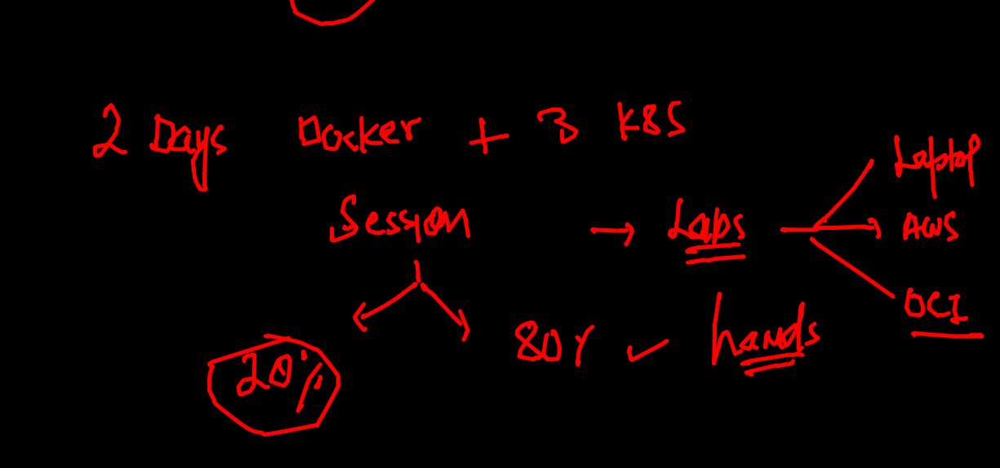
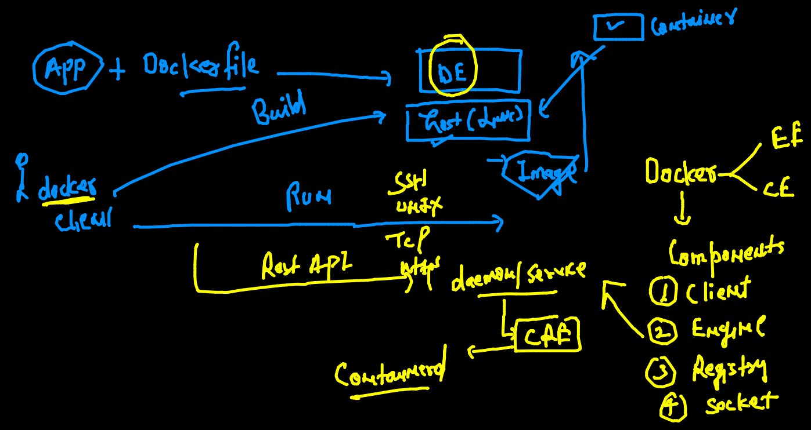
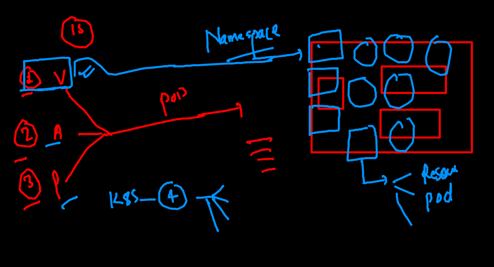
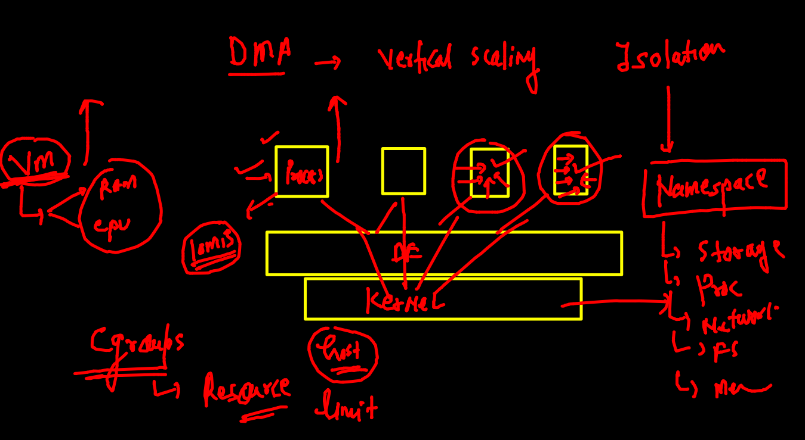
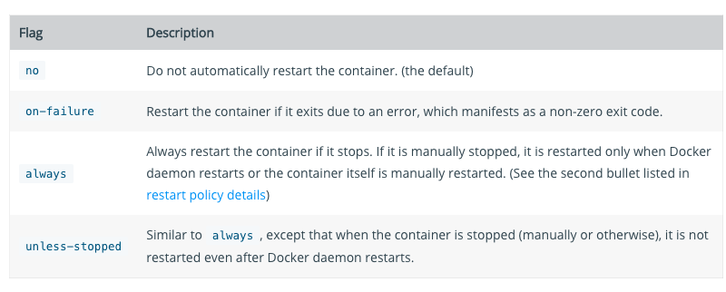

# oracle13thsept2021

## training plan 




## Day 1 revision 



## Namespace overview 



## cgroups 




## Cgroups 

### creating container

```
[ashu@ip-172-31-5-127 myimages]$ docker  run  -itd --name ashuc1  alpine  ping fb.com 
88982bbcaed91a3010a1ab59c9f9d16f3602aadd5c946738c2e5b9b18e793246
[ashu@ip-172-31-5-127 myimages]$ docker  ps
CONTAINER ID   IMAGE     COMMAND         CREATED          STATUS          PORTS     NAMES
88982bbcaed9   alpine    "ping fb.com"   19 seconds ago   Up 17 seconds             ashuc1

```

### apply cgroups 

```
 149  docker  run  -itd --name ashuc1  --memory 100m     alpine  ping fb.com 
  150  docker  run  -itd --name ashuc2  --memory 100m  --cpu-shares=20   alpine  ping fb.com 
  
```

## restart policy check 

```
[ashu@ip-172-31-5-127 myimages]$ docker  inspect  ashuc1  --format='{{.Id}}'
0874c9d2672a5df9da0d9cab15fc430094199dc2158d20d440df3d9fa642981a
[ashu@ip-172-31-5-127 myimages]$ 
[ashu@ip-172-31-5-127 myimages]$ docker  inspect  ashuc1  --format='{{.State.Status}}'
running
[ashu@ip-172-31-5-127 myimages]$ 
[ashu@ip-172-31-5-127 myimages]$ 
[ashu@ip-172-31-5-127 myimages]$ docker  inspect  ashuc1  --format='{{.HostConfig.RestartPolicy.Name}}'
no

```

### type fo restart policy 




```
 docker run -itd --name check1 --restart always  alpine ping fb.com 
 
```

