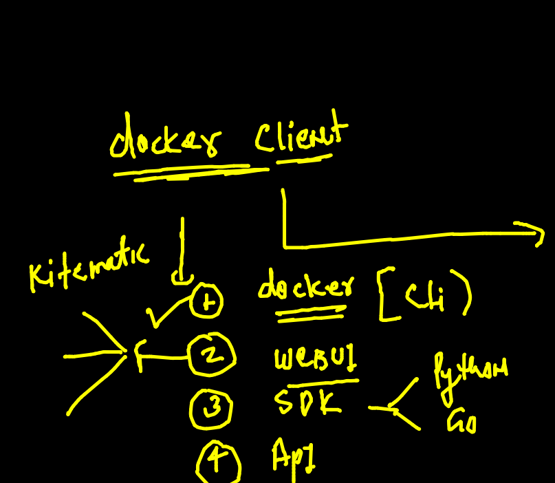
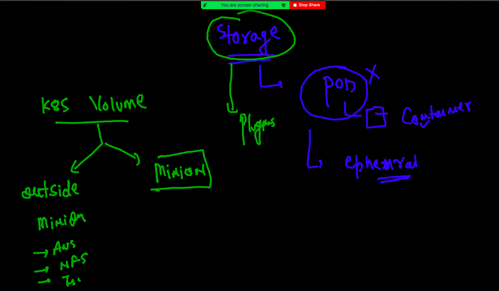

# oracle13thsept2021

## training plan 


## Day 1 revision 


## Namespace overview 


## cgroups 


## Cgroups 

### creating container

```
[ashu@ip-172-31-5-127 myimages]$ docker  run  -itd --name ashuc1  alpine  ping fb.com 
88982bbcaed91a3010a1ab59c9f9d16f3602aadd5c946738c2e5b9b18e793246
[ashu@ip-172-31-5-127 myimages]$ docker  ps
CONTAINER ID   IMAGE     COMMAND         CREATED          STATUS          PORTS     NAMES
88982bbcaed9   alpine    "ping fb.com"   19 seconds ago   Up 17 seconds             ashuc1

```

### apply cgroups 

```
 149  docker  run  -itd --name ashuc1  --memory 100m     alpine  ping fb.com 
  150  docker  run  -itd --name ashuc2  --memory 100m  --cpu-shares=20   alpine  ping fb.com 
  
```

## restart policy check 

```
[ashu@ip-172-31-5-127 myimages]$ docker  inspect  ashuc1  --format='{{.Id}}'
0874c9d2672a5df9da0d9cab15fc430094199dc2158d20d440df3d9fa642981a
[ashu@ip-172-31-5-127 myimages]$ 
[ashu@ip-172-31-5-127 myimages]$ docker  inspect  ashuc1  --format='{{.State.Status}}'
running
[ashu@ip-172-31-5-127 myimages]$ 
[ashu@ip-172-31-5-127 myimages]$ 
[ashu@ip-172-31-5-127 myimages]$ docker  inspect  ashuc1  --format='{{.HostConfig.RestartPolicy.Name}}'
no

```

### type fo restart policy 


```
 docker run -itd --name check1 --restart always  alpine ping fb.com 
 
```
### webapp containerization 

###  websevers 


### nginx web app containerization 

```
git clone https://github.com/mdn/beginner-html-site-styled

```

### building docker image

```
[ashu@ip-172-31-5-127 beginner-html-site-styled]$ docker  build -t  nginx:oracle14spet2021 .
Sending build context to Docker daemon  63.49kB
Step 1/3 : FROM nginx
 ---> ad4c705f24d3
Step 2/3 : LABEL email=ashutoshh@linux.com
 ---> Running in 764f691051c6
Removing intermediate container 764f691051c6
 ---> 0ec2fb8cf2b8
Step 3/3 : COPY . /usr/share/nginx/html/
 ---> 5cfc227811d4
Successfully built 5cfc227811d4
Successfully tagged nginx:oracle14spet2021

```

### creating container 

```
 docker  run -itd --name ashuweb  -p 2233:80  nginx:oracle14spet2021 
7fb1c1bfb74b6bcfb0f5f1f1471fbb15f1b19db78daa9ab770c97dd6b85b3170

```

## COntainer Networking 

### models 


### docker netowrking diagram 


### Docker check networking 

```
ashu@ip-172-31-5-127 beginner-html-site-styled]$ docker  network  ls
NETWORK ID     NAME      DRIVER    SCOPE
8f4044c8ba83   bridge    bridge    local
b0976616d56c   host      host      local
ce3c99056ff0   none      null      local

```

### checking networking 
```
ashu@ip-172-31-5-127 beginner-html-site-styled]$ docker  network inspect  8f4044c8ba83
[
    {
        "Name": "bridge",
        "Id": "8f4044c8ba83e6aea9fdaca1dcf64e867d4ab7f0f602fee93c3303408fc8e269",
        "Created": "2021-09-14T05:12:16.712123803Z",
        "Scope": "local",
        "Driver": "bridge",
        "EnableIPv6": false,
        "IPAM": {
            "Driver": "default",
            "Options": null,
            "Config": [
                {
                    "Subnet": "172.17.0.0/16",
                    "Gateway": "172.17.0.1"
                }
            ]
        },
        "Internal": false,
        "Attachable": false,
        
        
        ```
        
   ### COntainer IP address 
   
   ```
   
   ``
   
 ### Checking NAT 
 
 ```
 [ashu@ip-172-31-5-127 beginner-html-site-styled]$ docker  exec  -it  ashuc2  sh
/ # 
/ # ping google.com
PING google.com (142.251.33.206): 56 data bytes
64 bytes from 142.251.33.206: seq=0 ttl=111 time=1.125 ms
64 bytes from 142.251.33.206: seq=1 ttl=111 time=1.175 ms
64 bytes from 142.251.33.206: seq=2 ttl=111 time=1.106 ms
^C
--- google.com ping statistics ---
3 packets transmitted, 3 packets received, 0% packet loss
round-trip min/avg/max = 1.106/1.135/1.175 ms
/ # exit


```

### port wordarig 


### None bridge 

```
[ashu@ip-172-31-5-127 beginner-html-site-styled]$ docker  run -it --rm  --network  none alpine sh 
/ # 
/ # 
/ # ping  172.17.0.2
PING 172.17.0.2 (172.17.0.2): 56 data bytes
ping: sendto: Network unreachable
/ # 
/ # ping  google.com 
ping: bad address 'google.com'
/ # exit

```

### Host bridge usage 

```
 docker  run -it --rm  --network  host  alpine sh 
 
```

### creating network bridge 

```
ashu@ip-172-31-5-127 beginner-html-site-styled]$ docker  network   create  ashubr1
6a987d7ca7c363c1c71c38876de7bf14d196f855f517e6f263b82eb142476e81
[ashu@ip-172-31-5-127 beginner-html-site-styled]$ docker  network  ls
NETWORK ID     NAME      DRIVER    SCOPE
6a987d7ca7c3   ashubr1   bridge    local
8f4044c8ba83   bridge    bridge    local
b0976616d56c   host      host      local
ce3c99056ff0   none      null      local
[ashu@ip-172-31-5-127 beginner-html-site-styled]$ docker network  inspect  ashubr1
[
    {
        "Name": "ashubr1",
        "Id": "6a987d7ca7c363c1c71c38876de7bf14d196f855f517e6f263b82eb142476e81",
        "Created": "2021-09-14T07:13:37.840567804Z",
        "Scope": "local",
        "Driver": "bridge",
        "EnableIPv6": false,
        "IPAM": {
            "Driver": "default",
            "Options": {},
            "Config": [
                {
                    "Subnet": "172.18.0.0/16",
                    "Gateway": "172.18.0.1"
                }
            ]
        },
        "Internal": false,
        "Attachable": false,
        "Ingress": false,
        "ConfigFrom": {
            "Network": ""
        },
        "ConfigOnly": false,
        "Containers": {},
        "Options": {},
        "Labels": {}
    }
    
  ```
  
  ### custom bridge DNS is working 
  
  ```
  [ashu@ip-172-31-5-127 beginner-html-site-styled]$ docker  run -itd --name  ashux2  --network ashubr1 alpine sh 
7d86ff8d93c5aa6c8634028fb4e9f4a6d7b6b20377e00747c5dfe8e383196752

[ashu@ip-172-31-5-127 beginner-html-site-styled]$ 
[ashu@ip-172-31-5-127 beginner-html-site-styled]$ docker  run -itd --name  ashux3  --network ashubr1 alpine sh 
11f0e435cb44dfc8a6120ef69dbb265528865b0aa7c9d5e5d19d573152d13e01
[ashu@ip-172-31-5-127 beginner-html-site-styled]$ 
[ashu@ip-172-31-5-127 beginner-html-site-styled]$ docker  exec -it  ashux2 sh 
/ # 
/ # 
/ # ping  ashux3
PING ashux3 (172.18.0.3): 56 data bytes
64 bytes from 172.18.0.3: seq=0 ttl=255 time=0.111 ms
64 bytes from 172.18.0.3: seq=1 ttl=255 time=0.098 ms
^C
--- ashux3 ping statistics ---
2 packets transmitted, 2 packets received, 0% packet loss
round-trip min/avg/max = 0.098/0.104/0.111 ms
/ # exit

```

### custom bridge

```
[ashu@ip-172-31-5-127 beginner-html-site-styled]$ docker  network  create  ashubr2  --subnet 192.168.1.0/24 
2d18e9d653d4958c72adae3de8ab3b1b6e1c1e1a27d1f5f3c8897976d7d4db46
[ashu@ip-172-31-5-127 beginner-html-site-styled]$ docker  run -itd --name  ashuxx22  --network  ashubr2  alpine sh 
137d9b169b7fe4fdf209fdb67affd954abbe4ee303f576224d53f82ab3e17a0d
[ashu@ip-172-31-5-127 beginner-html-site-styled]$ docker  run -itd --name  ashuxx33   --network  ashubr2 --ip   192.168.1.100  alpine sh 
ac04e1daaa3474c295ccad0917fd9fdfdecc6a5a954b73191f58252088ece120
[ashu@ip-172-31-5-127 beginner-html-site-styled]$ docker  exec -it  ashuxx22 sh 
/ # ping ashuxx33
PING ashuxx33 (192.168.1.100): 56 data bytes
64 bytes from 192.168.1.100: seq=0 ttl=255 time=0.107 ms
64 bytes from 192.168.1.100: seq=1 ttl=255 time=0.086 ms
^C
--- ashuxx33 ping statistics ---
2 packets transmitted, 2 packets received, 0% packet loss
round-trip min/avg/max = 0.086/0.096/0.107 ms
/ # exit

```

### remove all custom bridge which is not used by any containers

```
[ashu@ip-172-31-5-127 beginner-html-site-styled]$ docker  network  prune 
WARNING! This will remove all custom networks not used by at least one container.
Are you sure you want to continue? [y/N] y
Deleted Networks:
ashubr1
sbridge1
ashubr2
priyanka2
vaseembr2
nikbr2
amanbr1
amanbr2
nikbr1
vaseembr1
bhaskerbr1
bhaskerbr2
priyankanetwork
sambr1
rohitbr1
gopalbr1
gopalbr2

```

## Docker CLient options 



### portainer deploy

```
 docker  run -itd --name weubui -p 9000:9000 --restart always -v  /var/run/docker.sock:/var/run/docker.sock  portainer/portainer
 
```

### SDK URL 

[SDK](https://docs.docker.com/engine/api/sdk/examples/)

## Storage concept in Docker 



### showing container ephemral nature 

```
[ashu@ip-172-31-5-127 beginner-html-site-styled]$ docker  run  -it --name ashuc1  alpine  sh 
/ # ls
bin    dev    etc    home   lib    media  mnt    opt    proc   root   run    sbin   srv    sys    tmp    usr    var
/ # mkdir hello world 
/ # ls
bin    dev    etc    hello  home   lib    media  mnt    opt    proc   root   run    sbin   srv    sys    tmp    usr    var    world
/ # echo  hello world >data.txt
/ # ls
bin       dev       hello     lib       mnt       proc      run       srv       tmp       var
data.txt  etc       home      media     opt       root      sbin      sys       usr       world
/ # exit
[ashu@ip-172-31-5-127 beginner-html-site-styled]$ docker  rm  ashuc1 
ashuc1
[ashu@ip-172-31-5-127 beginner-html-site-styled]$ docker  run  -it --name ashuc1  alpine  sh 
/ # ls
bin    dev    etc    home   lib    media  mnt    opt    proc   root   run    sbin   srv    sys    tmp    usr    var
/ # exit
[ashu@ip-172-31-5-127 beginner-html-site-styled]$ docker  rm  ashuc1
ashuc1

```

### creating volume 

```
[ashu@ip-172-31-5-127 beginner-html-site-styled]$ docker volume   create ashuvol1 
ashuvol1
[ashu@ip-172-31-5-127 beginner-html-site-styled]$ docker  volume  ls
DRIVER    VOLUME NAME
local     ashuvol1

```

### volume inspect 

```
[ashu@ip-172-31-5-127 beginner-html-site-styled]$ docker  volume  inspect   ashuvol1 
[
    {
        "CreatedAt": "2021-09-14T10:03:26Z",
        "Driver": "local",
        "Labels": {},
        "Mountpoint": "/var/lib/docker/volumes/ashuvol1/_data",
        "Name": "ashuvol1",
        "Options": {},
        "Scope": "local"
    }
]

```
### mounting a specific location folder  to the container 

```
[ashu@ip-172-31-5-127 myimages]$ ls
pythonapp  ubuntuimg  webapp
[ashu@ip-172-31-5-127 myimages]$ pwd
/home/ashu/myimages
[ashu@ip-172-31-5-127 myimages]$ docker  run -it --rm  -v  /home/ashu/myimages/webapp/:/data1:ro  alpine  sh 
/ # ls
bin    dev    home   media  opt    root   sbin   sys    usr
data1  etc    lib    mnt    proc   run    srv    tmp    var
/ # cd  data1/
/data1 # ls
CODE_OF_CONDUCT.md  LICENSE             images              styles
Dockerfile          README.md           index.html
/data1 # exit

```

### cleaning up docker engine 

```
268  docker  rm  $(docker  ps -aq) -f 
  269  docker  network prune 
  270  docker  volume  rm  $(docker  volume  ls -q)
  271  docker  rmi  $(docker  images -q) -f
  
```

### creating mysql Db container 

```
[ashu@ip-172-31-5-127 myimages]$ docker  run -itd  --name  ashudb  -e  MYSQL_ROOT_PASSWORD=Oracledb099  -v  ashudbvol1:/var/lib/mysql/   --restart  always  mysql 
Unable to find image 'mysql:latest' locally
latest: Pulling from library/mysql
a330b6cecb98: Already exists 
9c8f656c32b8: Already exists 
88e473c3f553: Already exists 
062463ea5d2f: Already exists 
daf7e3bdf4b6: Already exists 
1839c0b7aac9: Already exists 
cf0a0cfee6d0: Already exists 
1b42041bb11e: Already exists 
10459d86c7e6: Pull complete 
b7199599d5f9: Pull complete 
1d6f51e17d45: Pull complete 
50e0789bacad: Pull complete 
Digest: sha256:99e0989e7e3797cfbdb8d51a19d32c8d286dd8862794d01a547651a896bcf00c
Status: Downloaded newer image for mysql:latest
3a3637a1af544eee6f13716ee12ff31ca362226d0604e3912358c3dc8deb1357

```

### Deploy Mysql DB in seconds 

```
[ashu@ip-172-31-5-127 myimages]$ docker  exec  -it   ashudb  bash 
root@3a3637a1af54:/# 
root@3a3637a1af54:/# mysql  -u root -p
Enter password: 
Welcome to the MySQL monitor.  Commands end with ; or \g.
Your MySQL connection id is 9
Server version: 8.0.26 MySQL Community Server - GPL

Copyright (c) 2000, 2021, Oracle and/or its affiliates.

Oracle is a registered trademark of Oracle Corporation and/or its
affiliates. Other names may be trademarks of their respective
owners.

Type 'help;' or '\h' for help. Type '\c' to clear the current input statement.

mysql> show  databases;
+--------------------+
| Database           |
+--------------------+
| ashudb             |
| information_schema |
| mysql              |
| performance_schema |
| sys                |
+--------------------+
5 rows in set (0.01 sec)

mysql> quit;
Bye
```

### webapp with httpd 


### webapp building docker  images 

```
[ashu@ip-172-31-5-127 myimages]$ ls
customer1  pythonapp  ubuntuimg  webapp
[ashu@ip-172-31-5-127 myimages]$ cd  customer1/
[ashu@ip-172-31-5-127 customer1]$ ls
deploy.sh  Dockerfile  webapp1  webapp2  webapp3
[ashu@ip-172-31-5-127 customer1]$ docker build  -t   httpd:oraclesept142021v1 . 
Sending build context to Docker daemon  1.899MB
Step 1/13 : FROM oraclelinux:8.4
 ---> fcf3cbfc22ac
Step 2/13 : LABEL email=ashutoshh@linux.com
 ---> Using cache
 ---> 17bae20ee1b6
Step 3/13 : ENV  customer1=80900
 ---> Running in 3acf313ea476
Removing intermediate container 3acf313ea476
 ---> 3b921a69c51d
Step 4/13 : RUN dnf  install  httpd -y
 ---> Running in 038c5bbd5db8
Oracle Linux 8 BaseOS Latest (x86_64)           139 MB/s |  35 MB     00:00    


```

### deploy app3 
```
docker run -itd --name  cusapp3 -e customer1=app3  -p 1155:80 httpd:oraclesept142021v1
b6cd7ce2df29fb25de91abb8ea1551ff8dc129e43e121cdbd1ce76630111ea53

```

### pushing image to docker hub 

```
ashu@ip-172-31-5-127 customer1]$ docker  tag  httpd:oraclesept142021v1  dockerashu/httpd:orweb14sept2021 
[ashu@ip-172-31-5-127 customer1]$ docker  login 
Login with your Docker ID to push and pull images from Docker Hub. If you don't have a Docker ID, head over to https://hub.docker.com to create one.
Username: dockerashu
Password: 
WARNING! Your password will be stored unencrypted in /home/ashu/.docker/config.json.
Configure a credential helper to remove this warning. See
https://docs.docker.com/engine/reference/commandline/login/#credentials-store

Login Succeeded
[ashu@ip-172-31-5-127 customer1]$ docker  push  dockerashu/httpd:orweb14sept2021
The push refers to repository [docker.io/dockerashu/httpd]
910d6ffe87cf: Pushed 
085a5da63629: Pushed 
868115e5ff44: Pushed 
27e51df21442: Pushed 
b4ad427c2bba: Pushed 
f25943feda10: Pushed 
d0cc9c7e81b8: Pushed 
89ca13798c53: Mounted from library/oraclelinux 
orweb14sept2021: digest: sha256:edcc8a630dda837fdc4efa32c44f01544dc6fef3e288662f314175c03284216d size: 1992
[ashu@ip-172-31-5-127 customer1]$ docker  logout 
Removing login credentials for https://index.docker.io/v1/

```


