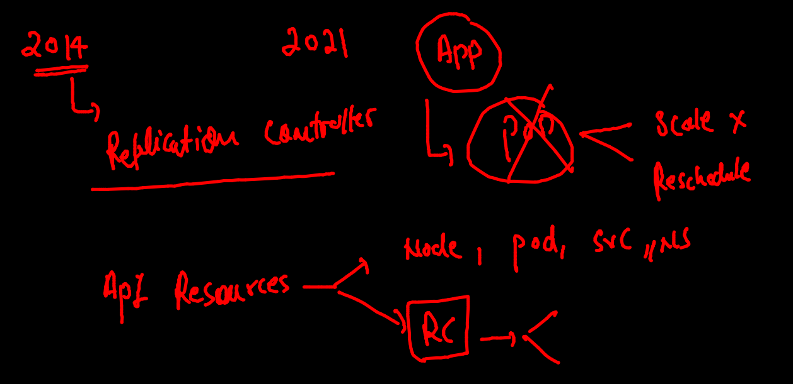
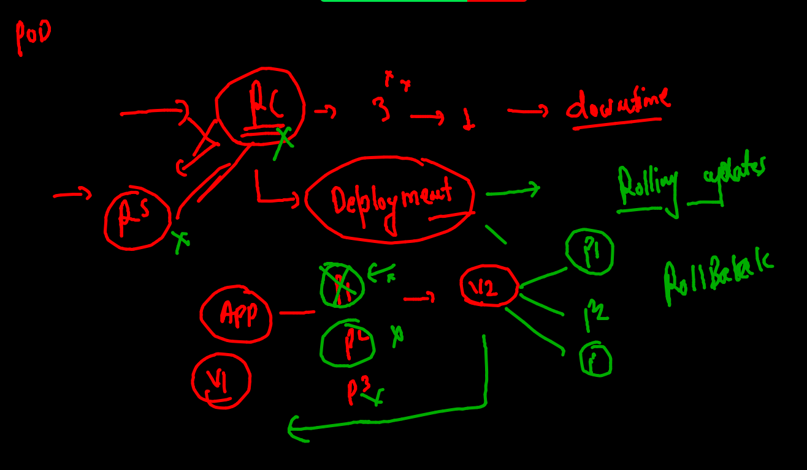
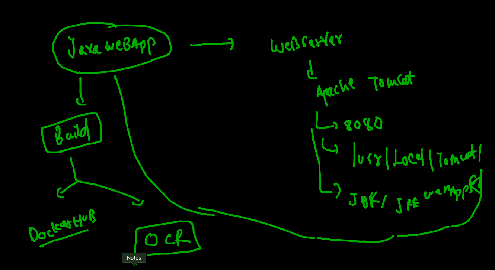
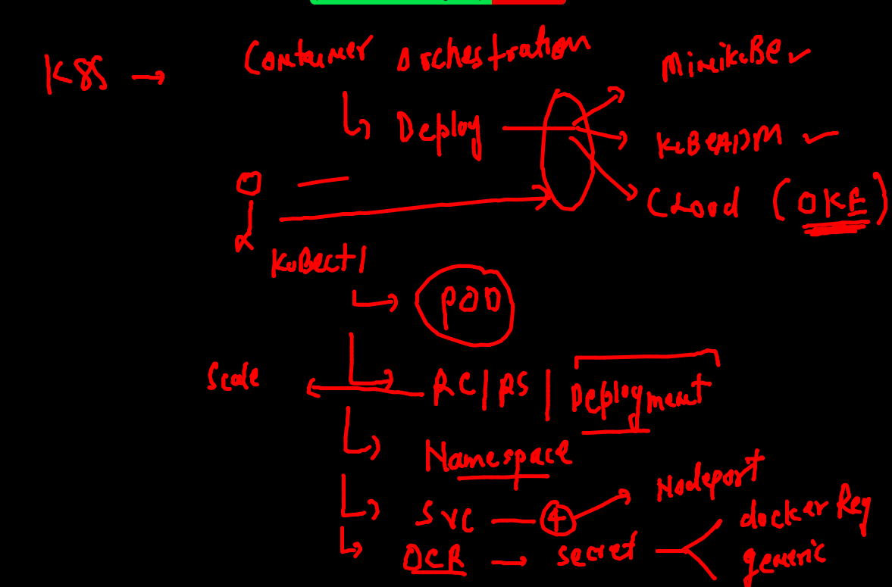

# oracle13thsept2021

## training plan 


##  day3 revision 


## cleaning up namespace pods 

```
 fire@ashutoshhs-MacBook-Air  ~  kubectl  config get-contexts 
CURRENT   NAME                          CLUSTER      AUTHINFO           NAMESPACE
*         kubernetes-admin@kubernetes   kubernetes   kubernetes-admin   ashu-space
 fire@ashutoshhs-MacBook-Air  ~  kubectl  get  po 
NAME         READY   STATUS    RESTARTS   AGE
ashupod2     1/1     Running   0          18h
ashuwebpod   1/1     Running   0          18h
 fire@ashutoshhs-MacBook-Air  ~  kubectl  delete  pods --all
pod "ashupod2" deleted
pod "ashuwebpod" deleted

```


## K8s Pod Networking 

### list of CNI 

[CNI URL](https://github.com/containernetworking/cni)

### POd networking L1


### deploying pod with ENV var 

```
fire@ashutoshhs-MacBook-Air  ~/Desktop/k8sapps  kubectl  run  ashuapp3  --image=dockerashu/httpd:orweb14sept2021  --port 80  --dry-run=client -o yaml 
apiVersion: v1
kind: Pod
metadata:
  creationTimestamp: null
  labels:
    run: ashuapp3
  name: ashuapp3
spec:
  containers:
  - image: dockerashu/httpd:orweb14sept2021
    name: ashuapp3
    ports:
    - containerPort: 80
    resources: {}
  dnsPolicy: ClusterFirst
  restartPolicy: Always
status: {}
 fire@ashutoshhs-MacBook-Air  ~/Desktop/k8sapps  kubectl  run  ashuapp3  --image=dockerashu/httpd:orweb14sept2021  --port 80  --dry-run=client -o yaml  >ashuapp3.yaml 
 
 ```
 
 ### Deploying pod 
 
 ```
 fire@ashutoshhs-MacBook-Air  ~/Desktop/k8sapps  kubectl  apply -f  ashuapp3.yaml 
pod/ashuapp3 created
 fire@ashutoshhs-MacBook-Air  ~/Desktop/k8sapps  kubectl  get  po 
NAME       READY   STATUS    RESTARTS   AGE
ashuapp3   1/1     Running   0          8s
 fire@ashutoshhs-MacBook-Air  ~/Desktop/k8sapps  kubectl  get  po  -o wide
NAME       READY   STATUS    RESTARTS   AGE   IP                NODE      NOMINATED NODE   READINESS GATES
ashuapp3   1/1     Running   0          14s   192.168.179.230   minion2   <none>           <none>
 fire@ashutoshhs-MacBook-Air  ~/Desktop/k8sapps  
 
```

## access pod app 

### case 1 from k8s client machine 
```
fire@ashutoshhs-MacBook-Air  ~/Desktop/k8sapps  kubectl  port-forward   ashuapp3  1234:80 
Forwarding from 127.0.0.1:1234 -> 80
Forwarding from [::1]:1234 -> 80
Handling connection for 1234
Handling connection for 1234
Handling connection for 1234
Handling connection for 1234
Handling connection for 1234
Handling connection for 1234
Handling connection for 1234

```

### case 2 as end user 

### Understanding and creating service 


### service can not use ip or name of pod to forward traffic 


### service will use label to find pod 


## type of service 


## Nodeport 


### checking label of POd

```
fire@ashutoshhs-MacBook-Air  ~/Desktop/k8sapps  kubectl  get  po  --show-labels 
NAME       READY   STATUS    RESTARTS   AGE   LABELS
ashuapp3   1/1     Running   0          42m   x=helloashuapp3

```

### Nodeport creation of service 

```
fire@ashutoshhs-MacBook-Air  ~/Desktop/k8sapps  kubectl  create   service  
Create a service using specified subcommand.

Aliases:
service, svc

Available Commands:
  clusterip    Create a ClusterIP service.
  externalname Create an ExternalName service.
  loadbalancer Create a LoadBalancer service.
  nodeport     Create a NodePort service.

Usage:


===


```

### creating service 

```
fire@ashutoshhs-MacBook-Air  ~/Desktop/k8sapps  kubectl  create   service   nodeport  ashusvc1  --tcp  1234:80  --dry-run=client  -o yaml 
apiVersion: v1
kind: Service
metadata:
  creationTimestamp: null
  labels:
    app: ashusvc1
  name: ashusvc1
spec:
  ports:
  - name: 1234-80
    port: 1234
    protocol: TCP
    targetPort: 80
  selector:
    app: ashusvc1
  type: NodePort
status:
  loadBalancer: {}
 fire@ashutoshhs-MacBook-Air  ~/Desktop/k8sapps  kubectl  create   service   nodeport  ashusvc1  --tcp  1234:80  --dry-run=client  -o yaml   >ashusvc1.yaml 
 
 ```
 
 ### matching label of POD to service selector 
 
 
 
 ### deploy service
 
 ```
  fire@ashutoshhs-MacBook-Air  ~/Desktop/k8sapps  kubectl  apply -f  ashusvc1.yaml 
service/ashusvc1 created
 fire@ashutoshhs-MacBook-Air  ~/Desktop/k8sapps  kubectl  get  service
NAME       TYPE       CLUSTER-IP    EXTERNAL-IP   PORT(S)          AGE
ashusvc1   NodePort   10.104.0.62   <none>        1234:32468/TCP   8s
 fire@ashutoshhs-MacBook-Air  ~/Desktop/k8sapps  kubectl  get  svc    
NAME       TYPE       CLUSTER-IP    EXTERNAL-IP   PORT(S)          AGE
ashusvc1   NodePort   10.104.0.62   <none>        1234:32468/TCP   12s

```

## cleaning up namespace 

```
fire@ashutoshhs-MacBook-Air  ~/Desktop/k8sapps  kubectl  get  all
NAME           READY   STATUS    RESTARTS   AGE
pod/ashuapp3   1/1     Running   0          95m

NAME               TYPE       CLUSTER-IP    EXTERNAL-IP   PORT(S)          AGE
service/ashusvc1   NodePort   10.104.0.62   <none>        1234:32468/TCP   43m
 fire@ashutoshhs-MacBook-Air  ~/Desktop/k8sapps  kubectl  delete  all --all
pod "ashuapp3" deleted
service "ashusvc1" deleted

```


## Intro to Replication controller 



### creating RC

```
replicationcontroller/ashurc-123 created (dry run)
 fire@ashutoshhs-MacBook-Air  ~/Desktop/k8sapps  kubectl apply -f  ashurc1.yaml                replicationcontroller/ashurc-123 created
 fire@ashutoshhs-MacBook-Air  ~/Desktop/k8sapps  kubectl  get  rc
NAME         DESIRED   CURRENT   READY   AGE
ashurc-123   1         1         1       8s
 fire@ashutoshhs-MacBook-Air  ~/Desktop/k8sapps  kubectl  get  po
NAME               READY   STATUS    RESTARTS   AGE
ashurc-123-x59qf   1/1     Running   0          16s

```

### scaling Pod 

```
fire@ashutoshhs-MacBook-Air  ~/Desktop/k8sapps  kubectl  scale  rc ashurc-123  --replicas=3
replicationcontroller/ashurc-123 scaled
 fire@ashutoshhs-MacBook-Air  ~/Desktop/k8sapps  kubectl  get  po 
NAME                   READY   STATUS    RESTARTS   AGE
ashurc-123-4xgll       0/1     Pending   0          5s
ashurc-123-9rzll       0/1     Pending   0          5s
ashurc-123-bj82w       1/1     Running   0          5m33s

```

### Journey from RC to RS to Deployement 



### Demo of deployment with OCR 



### Building tomcat app image 

```
 fire@ashutoshhs-MacBook-Air  ~  docker  build -t  ashujava:webappv1  https://github.com/redashu/javawebapp.git  
[+] Building 53.7s (3/8)                                                                                                       
 => CACHED [internal] load git source https://github.com/redashu/javawebapp.git                                           0.0s
 => [internal] load metadata for docker.io/library/tomcat:latest                                                          4.3s
 => [auth] library/tomcat:pull token for registry-1.docker.io                                                             0.0s
 => [1/5] FROM docker.io/library/tomcat@sha256:54876d82d30746c5b625a784938864d5b726219e0aace09b3e57ef4dfa85d594          49.4s
 => => resolve docker.io/library/tomcat@sha256:54876d82d30746c5b625a784938864d5b726219e0aace09b3e57ef4dfa85d594           0.0s
 => => sha256:54876d82d30746c5b625a784938864d5b726219e0aace09b3e57ef4dfa85d594 549B / 549B                                0.0s
 => => sha256:709c112a87273828f4df9caa99540a1d4f59891455cdfff7ec0ec99edc49f59b 2.42kB / 2.42kB                            0.0s
 => => sha256:955615a668ce
```


### pushing image to OCR 

```
4235 docker  tag  462a7d9a5f01   phx.ocir.io/axmbtg8judkl/javawebapp:v1 
 4236  docker  images
 4237  docker  login  phx.ocir.io  
 4238  docker  logout  phx.ocir.io  
 4239  docker  login  phx.ocir.io  
 fire@ashutoshhs-MacBook-Air  ~  docker push  phx.ocir.io/axmbtg8judkl/javawebapp:v1                 
The push refers to repository [phx.ocir.io/axmbtg8judkl/javawebapp]
387bab7ff1dd: Pushed 
5f70bf18a086: Pushed 
8b22855c0159: Pushed 
4831bcd1167f: Pushed 
977cfcbcf0fa: Pushing [======================>                            ]  8.926MB/20.16MB
4e4de253c94d: Pushed 
3891808a925b: Pushing [=>                                                 ]  13.22MB/342.7MB
d402f4f1b906: Pushed 
00ef5416d927: Pushing [==============================>                    ]  6.847MB/11.31MB
8555e663f65b: Pushing [=======>                                           ]  21.43MB/151.9MB
d00da3cd7763: Pushing [======================>                            ]  8.527MB/18.95MB
4e61e63529c2: Waiting 
799760671c38: Waiting 

```


### Deploy POD from OCR public repo 

```
 kubectl  run  ashujava --image=phx.ocir.io/axmbtg8judkl/javawebapp:v1  --port 8080
 
```

## TOmcat application poD using Deployment 

```
fire@ashutoshhs-MacBook-Air  ~/Desktop/k8sapps  kubectl  get  deploy
NAME       READY   UP-TO-DATE   AVAILABLE   AGE
ashudep1   1/1     1            1           74s
 fire@ashutoshhs-MacBook-Air  ~/Desktop/k8sapps  
 fire@ashutoshhs-MacBook-Air  ~/Desktop/k8sapps  
 fire@ashutoshhs-MacBook-Air  ~/Desktop/k8sapps  kubectl  expose deploy  ashudep1  --type NodePort --port 8080 --name ashusvc222
service/ashusvc222 exposed
 fire@ashutoshhs-MacBook-Air  ~/Desktop/k8sapps  
 fire@ashutoshhs-MacBook-Air  ~/Desktop/k8sapps  kubectl  get  svc
NAME         TYPE       CLUSTER-IP     EXTERNAL-IP   PORT(S)          AGE
ashusvc222   NodePort   10.98.11.156   <none>        8080:30497/TCP   6s

```

### creating task 

```
4339  kubectl  create namespace  ashuk8s1 --dry-run=client -o yaml 
 4340  kubectl  run  ashupod1 --image=ubuntu --commanda sleep 1200000 --namespace=ashuk8s1  --dry-run=client -o yaml 
 4341  kubectl  run  ashupod1 --image=ubuntu --command sleep 1200000 --namespace=ashuk8s1  --dry-run=client -o yaml 
 4342  kubectl  create  service  nodeport ashusvc1  --tcp 1234:80 --namespace=ashuk8s1 --dry-run=client -o yaml 
 4343  kubectl apply -f  mytask.yaml
 4344  kubectl  get  po,svc -n ashuk8s1 
 4345* cd Desktop
 4346* ls
 4347* echo heoop >hello.txt
 4348* ls
 4349  kubectl  cp ~/Desktop/hello.txt ashupod1:/tmp/
 4350  kubectl  cp ~/Desktop/hello.txt ashupod1:/tmp/  -n ashuk8s1 
 4351  kubectl  exec -it  ashupod1  -n ashuk8s1 -- bash 
 
 ```
 
 ### creating deployment 
 
 ```
 kubectl  create deployment  ashupvtimg  --image=phx.ocir.io/axmbtg8judkl/alpine:v1   --dry-run=client -o yaml 
apiVersion: apps/v1
kind: Deployment
metadata:
  creationTimestamp: null
  labels:
    app: ashupvtimg
  name: ashupvtimg
spec:
  replicas: 1
  selector:
    matchLabels:
      app: ashupvtimg
  strategy: {}
  template:
    metadata:
      creationTimestamp: null
      labels:
        app: ashupvtimg
    spec:
      containers:
      - image: phx.ocir.io/axmbtg8judkl/alpine:v1
        name: alpine
        resources: {}
        
 ```
 
 ### Troubleshooting 
 
 ### Errer image pull back off
 
 ```
 fire@ashutoshhs-MacBook-Air  ~/Desktop/k8sapps  kubectl apply  -f  ocr.yaml 
deployment.apps/ashupvtimg created
 fire@ashutoshhs-MacBook-Air  ~/Desktop/k8sapps  kubectl  get deploy 
NAME         READY   UP-TO-DATE   AVAILABLE   AGE
ashupvtimg   0/1     1            0           8s
 fire@ashutoshhs-MacBook-Air  ~/Desktop/k8sapps  kubectl  get  po 
NAME                          READY   STATUS             RESTARTS   AGE
ashupvtimg-6cd95bcd4f-rq2g5   0/1     ImagePullBackOff   0          23s
 fire@ashutoshhs-MacBook-Air  ~/Desktop/k8sapps  kubectl  get  po 
NAME                          READY   STATUS         RESTARTS   AGE
ashupvtimg-6cd95bcd4f-rq2g5   0/1     ErrImagePull   0          112s

```

### secret 

```
 kubectl  create secret docker-registry   ocrsec --docker-server=phx.ocir.io       --docker-username=axmbtg8judkl/learntechbyme@gmail.com  --docker-password="vpL0
 
 ```
 
 ### Db deployment in k8s 
 
 ### yaml creation 
 
 ```
 kubectl  create  deployment  ashudb --image=mysql  --dry-run=client -o yaml  >ashudb.yaml
 
 kubectl  create  secret   generic  ashudbsec  --from-literal x1=Oracledb088
 
 ```
 
 ### deploy 
 
 ```
 fire@ashutoshhs-MacBook-Air  ~/Desktop/k8sapps  kubectl apply -f  ashudb.yaml 
deployment.apps/ashudb created
 fire@ashutoshhs-MacBook-Air  ~/Desktop/k8sapps  kubectl  get  deploy 
NAME         READY   UP-TO-DATE   AVAILABLE   AGE
ashudb       1/1     1            1           7s
ashupvtimg   1/1     1            1           36m
 fire@ashutoshhs-MacBook-Air  ~/Desktop/k8sapps  kubectl  get  po 
NAME                          READY   STATUS    RESTARTS   AGE
ashudb-6ccc868488-hkbnk       1/1     Running   0          14s
ashupvtimg-765988678b-rlpjr   1/1     Running   0          36m
 fire@ashutoshhs-MacBook-Air  ~/Desktop/k8sapps  kubectl  get  secret
NAME                  TYPE                                  DATA   AGE
ashudbsec             Opaque                                1      5m48s

```

### checking logs and login to db 

```
4412  kubectl  logs -f ashudb-6ccc868488-hkbnk 
 fire@ashutoshhs-MacBook-Air  ~/Desktop/k8sapps  kubectl  exec -it ashudb-6ccc868488-hkbnk  -- bash 
root@ashudb-6ccc868488-hkbnk:/# 
root@ashudb-6ccc868488-hkbnk:/# 
root@ashudb-6ccc868488-hkbnk:/# 
root@ashudb-6ccc868488-hkbnk:/# mysql  -u root -p
Enter password: 
Welcome to the MySQL monitor.  Commands end with ; or \g.
Your MySQL connection id is 8
Server version: 8.0.26 MySQL Community Server - GPL

Copyright (c) 2000, 2021, Oracle and/or its affiliates.

Oracle is a registered trademark of Oracle Corporation and/or its
affiliates. Other names may be trademarks of their respective
owners.

Type 'help;' or '\h' for help. Type '\c' to clear the current input statement.

mysql> ^DBye
root@ashudb-6ccc868488-hkbnk:/# exit
exit

```

### cleanup 

```
fire@ashutoshhs-MacBook-Air  ~/Desktop/k8sapps  kubectl  delete all --all
pod "ashudb-6ccc868488-hkbnk" deleted
pod "ashupvtimg-765988678b-rlpjr" deleted
deployment.apps "ashudb" deleted
deployment.apps "ashupvtimg" deleted
 fire@ashutoshhs-MacBook-Air  ~/Desktop/k8sapps  kubectl  get  secret 
NAME                  TYPE                                  DATA   AGE
ashudbsec             Opaque                                1      8m35s
default-token-8b5s6   kubernetes.io/service-account-token   3      125m
ocrsec                kubernetes.io/dockerconfigjson        1      45m
 fire@ashutoshhs-MacBook-Air  ~/Desktop/k8sapps  kubectl delete secret  ashudbsec 
secret "ashudbsec" deleted

```

### k8s summary 




