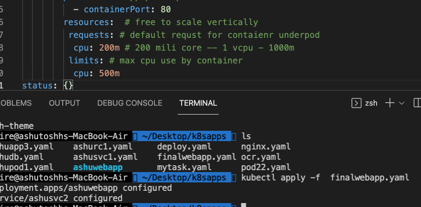

# oracle13thsept2021

## training plan 


### Certification in k8s


## Understanding deployment in more detail 


## creating webapp v1 

### building image 

```
 docker build -t  dockerashu/finalwebapp:appv1 -f  nginx.dockerfile  .
 
```

### pushing image to docker hub 

```
fire@ashutoshhs-MacBook-Air  ~/Desktop/k8sapps/ashuwebapp  docker  login -u dockerashu
Password: 
Login Succeeded
 fire@ashutoshhs-MacBook-Air  ~/Desktop/k8sapps/ashuwebapp  docker  push  dockerashu/finalwebapp:appv1
The push refers to repository [docker.io/dockerashu/finalwebapp]
5669e01016f7: Pushing [==================================================>]  75.26kB
5f70bf18a086: Mounted from dockerashu/ashuoracleweb 
fac15b2caa0c: Mounted from library/nginx 
f8bf5746ac5a: Mounted from 

```

### creating webapp 

```
kubectl  create deployment  ashuwebapp --image=dockerashu/finalwebapp:appv1   --dry-run=client  -o yaml  >finalwebapp.yaml

```

### creating service yaml 

```
kubectl  create  service  nodeport ashusvc2 --tcp  1234:80  --dry-run=client -o yaml 
apiVersion: v1
kind: Service
metadata:
  creationTimestamp: null
  labels:
    app: ashusvc2
  name: ashusvc2
spec:
  ports:
  - name: 1234-80
    port: 1234
    protocol: TCP
    targetPort: 80
  selector:
    app: ashusvc2
  type: NodePort
status:
  loadBalancer: {}
  
```

### deploying 
```
fire@ashutoshhs-MacBook-Air  ~/Desktop/k8sapps  kubectl apply -f finalwebapp.yaml 
deployment.apps/ashuwebapp created
service/ashusvc2 created
 fire@ashutoshhs-MacBook-Air  ~/Desktop/k8sapps  kubectl  get deploy 
NAME         READY   UP-TO-DATE   AVAILABLE   AGE
ashuwebapp   1/1     1            1           14s
 fire@ashutoshhs-MacBook-Air  ~/Desktop/k8sapps  kubectl  get po     
NAME                         READY   STATUS    RESTARTS   AGE
ashuwebapp-bb87d68b9-7hcqn   1/1     Running   0          19s
 fire@ashutoshhs-MacBook-Air  ~/Desktop/k8sapps  kubectl  get  svc
NAME       TYPE       CLUSTER-IP      EXTERNAL-IP   PORT(S)          AGE
ashusvc2   NodePort   10.110.92.224   <none>        1234:31519/TCP   23s

```

### scaling of pod by deployment 


### manual pod scaling 

```
fire@ashutoshhs-MacBook-Air  ~/Desktop/k8sapps  kubectl scale  deploy ashuwebapp --replicas=3
deployment.apps/ashuwebapp scaled
 fire@ashutoshhs-MacBook-Air  ~/Desktop/k8sapps  
 fire@ashutoshhs-MacBook-Air  ~/Desktop/k8sapps  kubectl  get  deploy                         
NAME         READY   UP-TO-DATE   AVAILABLE   AGE
ashuwebapp   3/3     3            3           6m2s
 fire@ashutoshhs-MacBook-Air  ~/Desktop/k8sapps  kubectl get po -o wide
NAME                         READY   STATUS    RESTARTS   AGE     IP                NODE      NOMINATED NODE   READINESS GATES
ashuwebapp-bb87d68b9-7hcqn   1/1     Running   0          6m10s   192.168.179.252   minion2   <none>           <none>
ashuwebapp-bb87d68b9-jsf9q   1/1     Running   0          14s     192.168.179.203   minion2   <none>           <none>
ashuwebapp-bb87d68b9-rsnmp   1/1     Running   0          14s     192.168.34.40     minion1   <none>           <none>

```

### auto scaling 

### vertical scaling limiting 



### checking resource consumption 

```
✘ fire@ashutoshhs-MacBook-Air  ~/Desktop/k8sapps  kubectl  get  po 
NAME                          READY   STATUS    RESTARTS   AGE
ashuwebapp-7d7cb4c85f-pnpmq   1/1     Running   0          3m44s
 fire@ashutoshhs-MacBook-Air  ~/Desktop/k8sapps  kubectl  top  pod  ashuwebapp-7d7cb4c85f-pnpmq
W0917 10:57:41.329663   17440 top_pod.go:140] Using json format to get metrics. Next release will switch to protocol-buffers, switch early by passing --use-protocol-buffers flag
NAME                          CPU(cores)   MEMORY(bytes)   
ashuwebapp-7d7cb4c85f-pnpmq   0m           3Mi      

```

### HPA 


### apply HPA 

```
 kubectl autoscale deployment ashuwebapp  --min=1 --max=10   --cpu-percent=80
horizontalpodautoscaler.autoscaling/ashuwebapp autoscaled
 fire@ashutoshhs-MacBook-Air  ~/Desktop/k8sapps  
 fire@ashutoshhs-MacBook-Air  ~/Desktop/k8sapps  
 fire@ashutoshhs-MacBook-Air  ~/Desktop/k8sapps  kubectl  get  hpa
NAME         REFERENCE               TARGETS         MINPODS   MAXPODS   REPLICAS   AGE
ashuwebapp   Deployment/ashuwebapp   <unknown>/80%   1         10        0          5s

```


