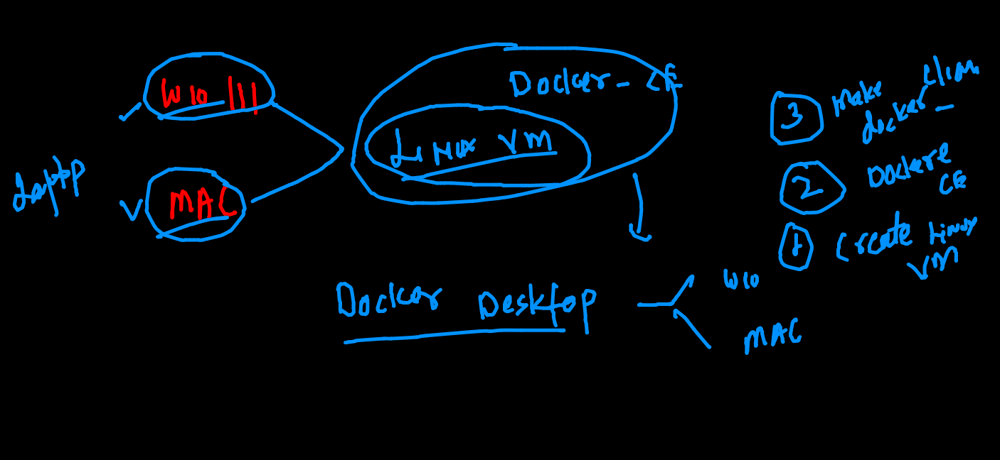

# oracle13thsept2021

## training plan 


## app deploy and testing problem with bare-metal 


## Understanding kernel the os part 


## Intro to container 


### Hypervisor vs CRE (container runtime engine)


### Intro to docker 


## Docker info two 


### Intro to docker desktop 




### checking docker version 

```
❯ docker  version
Client:
 Cloud integration: 1.0.17
 Version:           20.10.7
 API version:       1.41
 Go version:        go1.16.4
 Git commit:        f0df350
 Built:             Wed Jun  2 11:56:22 2021
 OS/Arch:           darwin/amd64
 Context:           default
 Experimental:      true

```

## Docker ce installation on Windows / mac 

### use Docker Desktop / tool box 

## to install Docker ce in any LInux host 

### Ubuntu 
[docker install](https://docs.docker.com/engine/install/ubuntu/). 

### Installing docker in amazon linux

```

[root@ip-172-31-5-127 ~]# yum  install docker  -y
Failed to set locale, defaulting to C
Loaded plugins: extras_suggestions, langpacks, priorities, update-motd
amzn2-core                                                                                     | 3.7 kB  00:00:00     
Resolving Dependencies
--> Running transaction check
---> Package docker.x86_64 0:20.10.7-1.amzn2 will be installed
--> Processing Dependency: runc >= 1.0.0 for package: docker-20.10.7-1.amzn2.x86_64
--> Processing Dependency: libcgroup >= 0.40.rc1-5.15 for package: docker-20.10.7-1.amzn2.x86_64
--> Processing Dependency: containerd >= 1.3.2 for package: docker-20.10.7-1.amzn2.x86_64
--> Processing Dependency: pigz for package: docker-20.10.7-1.amzn2.x86_64
--> Running transaction check
---> Package containerd.x86_64 0:1.4.6-2.amzn2 will be installed
---> Package libcgroup.x86_64 0:0.41-21.amzn2 will be installed
---> Package pigz.x86_64 0:2.3.4-1.amzn2.0.1 will be installed
---> Package runc.x86_64 0:1.0.0-1.amzn2 will be installed

```

### Enable docker engine 

```
[root@ip-172-31-5-127 ~]# systemctl start docker 
[root@ip-172-31-5-127 ~]# systemctl status docker 
● docker.service - Docker Application Container Engine
   Loaded: loaded (/usr/lib/systemd/system/docker.service; disabled; vendor preset: disabled)
   Active: active (running) since Mon 2021-09-13 06:23:29 UTC; 6s ago
     Docs: https://docs.docker.com
  Process: 2849 ExecStartPre=/usr/libexec/docker/docker-setup-runtimes.sh (code=exited, status=0/SUCCESS)
  Process: 2834 ExecStartPre=/bin/mkdir -p /run/docker (code=exited, status=0/SUCCESS)
 Main PID: 2857 (dockerd)
    Tasks: 8
   Memory: 38.1M
   CGroup: /system.slice/docker.service
           └─2857 /usr/bin/dockerd -H fd:// --containerd=/run/containerd/containerd.sock --default-ulimit nofile=32...

Sep 13 06:23:29 ip-172-31-5-127.ec2.internal dockerd[2857]: time="2021-09-13T06:23:29.115090581Z" level=info msg...rpc
Sep 13 06:23:29 ip-172-31-5-127.ec2.internal dockerd[2857]: time="2021-09-13T06:23:29.115227650Z" level=info msg...rpc
Sep 13 06:23:29 ip-172-31-5-127.ec2.internal dockerd[2857]: time="2021-09-13T06:23:29.115255301Z" level=info msg...rpc
Sep 13 06:23:29 ip-172-31-5-127.ec2.internal dockerd[2857]: time="2021-09-13T06:23:29.178567675Z" level=info msg...t."
Sep 13 06:23:29 ip-172-31-5-127.ec2.internal dockerd[2857]: time="2021-09-13T06:23:29.674957928Z" level=info msg...ss"
Sep 13 06:23:29 ip-172-31-5-127.ec2.internal dockerd[2857]: time="2021-09-13T06:23:29.916271129Z" level=info msg...e."
Sep 13 06:23:29 ip-172-31-5-127.ec2.internal dockerd[2857]: time="2021-09-13T06:23:29.946048384Z" level=info msg...0.7
Sep 13 06:23:29 ip-172-31-5-127.ec2.internal dockerd[2857]: time="2021-09-13T06:23:29.946149915Z" level=info msg...on"
Sep 13 06:23:29 ip-172-31-5-127.ec2.internal systemd[1]: Started Docker Application Container Engine.
Sep 13 06:23:29 ip-172-31-5-127.ec2.internal dockerd[2857]: time="2021-09-13T06:23:29.968624634Z" level=info msg...ck"
Hint: Some lines were ellipsized, use -l to show in full.
[root@ip-172-31-5-127 ~]# systemctl enable docker 
Created symlink from /etc/systemd/system/multi-user.target.wants/docker.service to /usr/lib/systemd/system/docker.service.

```

### How we will be using it 


### Docker CE architecture 


### to work with COntainers

### Vm vs container


### searching docker images in docker hub 


### pulling images

```
[ashu@ip-172-31-5-127 ~]$ docker  pull    ubuntu 
Using default tag: latest
latest: Pulling from library/ubuntu
35807b77a593: Pull complete 
Digest: sha256:9d6a8699fb5c9c39cf08a0871bd6219f0400981c570894cd8cbea30d3424a31f
Status: Downloaded newer image for ubuntu:latest
docker.io/library/ubuntu:latest
[ashu@ip-172-31-5-127 ~]$ docker  images
REPOSITORY   TAG       IMAGE ID       CREATED       SIZE
ubuntu       latest    fb52e22af1b0   13 days ago   72.8MB


```

## Docker registry options 

### Docker hub 
### Quay.io 
###  


## creating first container 

```

[ashu@ip-172-31-5-127 ~]$ docker   run  --name  ashuc1  -it -d   alpine   ping localhost 
e01aacfd82b00819864bca3e1c015b04a20e977fbcf1204aa0cb5d81f2dc0498
[ashu@ip-172-31-5-127 ~]$ docker  ps
CONTAINER ID   IMAGE     COMMAND            CREATED          STATUS          PORTS     NAMES
f4aa5725b3be   alpine    "ping localhost"   28 seconds ago   Up 28 seconds             bhaskerc1
e01aacfd82b0   alpine    "ping localhost"   55 seconds ago   Up 55 seconds             ashuc1


```

### checking output of a container program 

```
  18  docker  logs  ashuc1  
   19  docker  logs  -f ashuc1  
   
```

### stopping container manually 

```
[ashu@ip-172-31-5-127 ~]$ docker  stop   ashuc1
ashuc1

```

### list of all container

```
[ashu@ip-172-31-5-127 ~]$ docker  ps  -a
CONTAINER ID   IMAGE     COMMAND            CREATED         STATUS                            PORTS     NAMES
91efd45593ee   alpine    "ping localhost"   3 minutes ago   Up 3 minutes                                ati4
42b5b2c7acf5   alpine    "ping localhost"   6 minutes ago   Exited (137) 16 seconds ago                 rohit1
5e0ecc056cdc   alpine    "ping localhost"   6 minutes ago   Exited (137) About a minute ago             samanyuc1
80bf6092d69d   alpine    "ping localhost"   6 minutes ago   Exited (137) About a minute ago             raminder_c1
462537601e58   alpine    "ping localhost"   6 minutes ago   Up 6 minutes                                soumyac1
c1fcc62a019f   alpine    "ping localhost"   6 minutes ago   Exited (137) 31 seconds ago                 amanc1
6709aab94809   alpine    "ping localhost"

```

### restart container with same process

```
ashu@ip-172-31-5-127 ~]$ docker  start   ashuc1
ashuc1
[ashu@ip-172-31-5-127 ~]$ docker ps
CONTAINER ID   IMAGE     COMMAND            CREATED          STATUS         PORTS     NAMES
91efd45593ee   alpine    "ping localhost"   5 minutes ago    Up 5 minutes             ati4
e01aacfd82b0   alpine    "ping localhost"   11 minutes ago   Up 4 seconds             ashuc1

```

### checking host os and kernel details 

```
ashu@ip-172-31-5-127 ~]$ uname  -r
4.14.243-185.433.amzn2.x86_64
[ashu@ip-172-31-5-127 ~]$ 
[ashu@ip-172-31-5-127 ~]$ cat  /etc/os-release 
NAME="Amazon Linux"
VERSION="2"
ID="amzn"
ID_LIKE="centos rhel fedora"
VERSION_ID="2"
PRETTY_NAME="Amazon Linux 2"
ANSI_COLOR="0;33"
CPE_NAME="cpe:2.3:o:amazon:amazon_linux:2"
HOME_URL="https://amazonlinux.com/"

```

### checking kernel of container

```
ashu@ip-172-31-5-127 ~]$ docker   exec  -it   ashuc1   sh  
/ # 
/ # uname  -r
4.14.243-185.433.amzn2.x86_64
/ # 
/ # cat  /etc/os-release 
NAME="Alpine Linux"
ID=alpine
VERSION_ID=3.14.2
PRETTY_NAME="Alpine Linux v3.14"
HOME_URL="https://alpinelinux.org/"
BUG_REPORT_URL="https://bugs.alpinelinux.org/"
/ # exit

```

