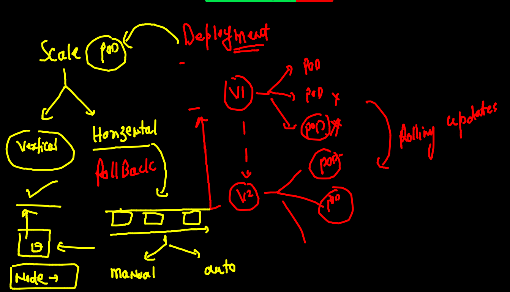
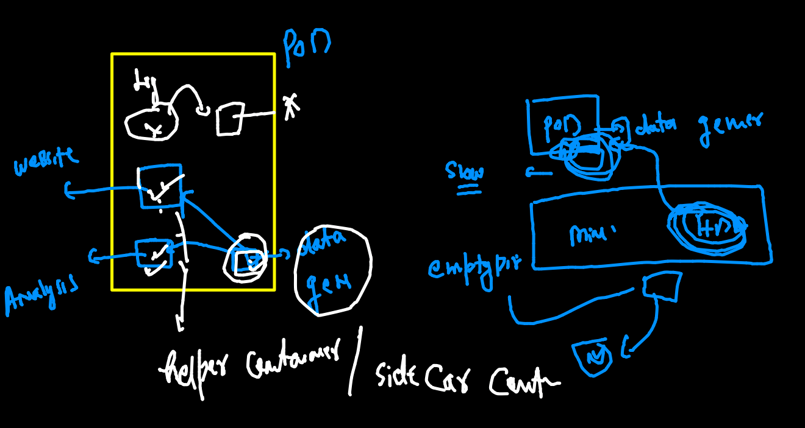

# oracle13thsept2021

## training plan 


### Certification in k8s


## Understanding deployment in more detail 


## creating webapp v1 

### building image 

```
 docker build -t  dockerashu/finalwebapp:appv1 -f  nginx.dockerfile  .
 
```

### pushing image to docker hub 

```
fire@ashutoshhs-MacBook-Air  ~/Desktop/k8sapps/ashuwebapp  docker  login -u dockerashu
Password: 
Login Succeeded
 fire@ashutoshhs-MacBook-Air  ~/Desktop/k8sapps/ashuwebapp  docker  push  dockerashu/finalwebapp:appv1
The push refers to repository [docker.io/dockerashu/finalwebapp]
5669e01016f7: Pushing [==================================================>]  75.26kB
5f70bf18a086: Mounted from dockerashu/ashuoracleweb 
fac15b2caa0c: Mounted from library/nginx 
f8bf5746ac5a: Mounted from 

```

### creating webapp 

```
kubectl  create deployment  ashuwebapp --image=dockerashu/finalwebapp:appv1   --dry-run=client  -o yaml  >finalwebapp.yaml

```

### creating service yaml 

```
kubectl  create  service  nodeport ashusvc2 --tcp  1234:80  --dry-run=client -o yaml 
apiVersion: v1
kind: Service
metadata:
  creationTimestamp: null
  labels:
    app: ashusvc2
  name: ashusvc2
spec:
  ports:
  - name: 1234-80
    port: 1234
    protocol: TCP
    targetPort: 80
  selector:
    app: ashusvc2
  type: NodePort
status:
  loadBalancer: {}
  
```

### deploying 
```
fire@ashutoshhs-MacBook-Air  ~/Desktop/k8sapps  kubectl apply -f finalwebapp.yaml 
deployment.apps/ashuwebapp created
service/ashusvc2 created
 fire@ashutoshhs-MacBook-Air  ~/Desktop/k8sapps  kubectl  get deploy 
NAME         READY   UP-TO-DATE   AVAILABLE   AGE
ashuwebapp   1/1     1            1           14s
 fire@ashutoshhs-MacBook-Air  ~/Desktop/k8sapps  kubectl  get po     
NAME                         READY   STATUS    RESTARTS   AGE
ashuwebapp-bb87d68b9-7hcqn   1/1     Running   0          19s
 fire@ashutoshhs-MacBook-Air  ~/Desktop/k8sapps  kubectl  get  svc
NAME       TYPE       CLUSTER-IP      EXTERNAL-IP   PORT(S)          AGE
ashusvc2   NodePort   10.110.92.224   <none>        1234:31519/TCP   23s

```

### scaling of pod by deployment 



### manual pod scaling 

```
fire@ashutoshhs-MacBook-Air  ~/Desktop/k8sapps  kubectl scale  deploy ashuwebapp --replicas=3
deployment.apps/ashuwebapp scaled
 fire@ashutoshhs-MacBook-Air  ~/Desktop/k8sapps  
 fire@ashutoshhs-MacBook-Air  ~/Desktop/k8sapps  kubectl  get  deploy                         
NAME         READY   UP-TO-DATE   AVAILABLE   AGE
ashuwebapp   3/3     3            3           6m2s
 fire@ashutoshhs-MacBook-Air  ~/Desktop/k8sapps  kubectl get po -o wide
NAME                         READY   STATUS    RESTARTS   AGE     IP                NODE      NOMINATED NODE   READINESS GATES
ashuwebapp-bb87d68b9-7hcqn   1/1     Running   0          6m10s   192.168.179.252   minion2   <none>           <none>
ashuwebapp-bb87d68b9-jsf9q   1/1     Running   0          14s     192.168.179.203   minion2   <none>           <none>
ashuwebapp-bb87d68b9-rsnmp   1/1     Running   0          14s     192.168.34.40     minion1   <none>           <none>

```

### auto scaling 

### vertical scaling limiting 


### checking resource consumption 

```
✘ fire@ashutoshhs-MacBook-Air  ~/Desktop/k8sapps  kubectl  get  po 
NAME                          READY   STATUS    RESTARTS   AGE
ashuwebapp-7d7cb4c85f-pnpmq   1/1     Running   0          3m44s
 fire@ashutoshhs-MacBook-Air  ~/Desktop/k8sapps  kubectl  top  pod  ashuwebapp-7d7cb4c85f-pnpmq
W0917 10:57:41.329663   17440 top_pod.go:140] Using json format to get metrics. Next release will switch to protocol-buffers, switch early by passing --use-protocol-buffers flag
NAME                          CPU(cores)   MEMORY(bytes)   
ashuwebapp-7d7cb4c85f-pnpmq   0m           3Mi      

```

### HPA 


### apply HPA 

```
 kubectl autoscale deployment ashuwebapp  --min=1 --max=10   --cpu-percent=80
horizontalpodautoscaler.autoscaling/ashuwebapp autoscaled
 fire@ashutoshhs-MacBook-Air  ~/Desktop/k8sapps  
 fire@ashutoshhs-MacBook-Air  ~/Desktop/k8sapps  
 fire@ashutoshhs-MacBook-Air  ~/Desktop/k8sapps  kubectl  get  hpa
NAME         REFERENCE               TARGETS         MINPODS   MAXPODS   REPLICAS   AGE
ashuwebapp   Deployment/ashuwebapp   <unknown>/80%   1         10        0          5s

```

### End to end app access


### diff b/w Nodeport and loadbalancer service 


## for non cloud k8s service Nodeport and LB svc are 100% same 

```
kubectl  expose deploy  ashuwebapp  --type LoadBalancer --port 80 --name  ashulbsvc  
service/ashulbsvc exposed
 fire@ashutoshhs-MacBook-Air  ~/Desktop/k8sapps  kubectl get  svc 
NAME        TYPE           CLUSTER-IP       EXTERNAL-IP   PORT(S)          AGE
ashulbsvc   LoadBalancer   10.107.228.109   <pending>     80:32311/TCP     4s
ashusvc2    NodePort       10.110.92.224    <none>        1234:31519/TCP   75m

```

### updataing app

```
 kubectl  describe  deploy  ashuwebapp
Name:                   ashuwebapp
Namespace:              ashu-space
CreationTimestamp:      Fri, 17 Sep 2021 10:37:06 +0530
Labels:                 app=ashuwebapp
Annotations:            deployment.kubernetes.io/revision: 2
Selector:               app=ashuwebapp
Replicas:               1 desired | 1 updated | 1 total | 1 available | 0 unavailable
StrategyType:           RollingUpdate
MinReadySeconds:        0
RollingUpdateStrategy:  25% max unavailable, 25% max surge
Pod Template:
  Labels:  app=ashuwebapp
  Containers:
   finalwebapp:
    Image:      dockerashu/finalwebapp:appv1
    Port:       80/TCP
    Host Port:  0/TCP
    Limits:
      cpu:  500m
    Requests:
      cpu:        200m
    Environment:  <none>
    Mounts:       <none>
  Volumes:        <none>
Conditions:
  Type           Status  Reason
  ----           ------  ------
  Available      True    MinimumReplicasAvailable
  Progressing    True    NewReplicaSetAvailable
OldReplicaSets:  <none>
NewReplicaSet:   ashuwebapp-7d7cb4c85f (1/1 replicas created)
Events:          <none>
 fire@ashutoshhs-MacBook-Air  ~/Desktop/k8sapps/ashuwebapp  kubectl  set  image  deploy ashuwebapp finalwebapp=dockerashu/finalwebapp:appv2  
deployment.apps/ashuwebapp image updated

```

### rolling update and rollout 

```
fire@ashutoshhs-MacBook-Air  ~/Desktop/k8sapps/ashuwebapp  kubectl rollout history deploy ashuwebapp
deployment.apps/ashuwebapp 
REVISION  CHANGE-CAUSE
1         <none>
2         <none>
3         <none>

 fire@ashutoshhs-MacBook-Air  ~/Desktop/k8sapps/ashuwebapp  kubectl rollout undo deploy ashuwebapp --to-revision=1
deployment.apps/ashuwebapp rolled back
 fire@ashutoshhs-MacBook-Air  ~/Desktop/k8sapps/ashuwebapp  kubectl rollout undo deploy ashuwebapp --to-revision=2
deployment.apps/ashuwebapp rolled back
 fire@ashutoshhs-MacBook-Air  ~/Desktop/k8sapps/ashuwebapp  kubectl rollout undo deploy ashuwebapp --to-revision=3
deployment.apps/ashuwebapp rolled back

```

## Kubernetes dashboard deployment 

```
kubectl apply -f https://raw.githubusercontent.com/kubernetes/dashboard/v2.3.1/aio/deploy/recommended.yaml
namespace/kubernetes-dashboard created
serviceaccount/kubernetes-dashboard created
service/kubernetes-dashboard created
secret/kubernetes-dashboard-certs created
secret/kubernetes-dashboard-csrf created
secret/kubernetes-dashboard-key-holder created
configmap/kubernetes-dashboard-settings created
role.rbac.authorization.k8s.io/kubernetes-dashboard created
clusterrole.rbac.authorization.k8s.io/kubernetes-dashboard created
rolebinding.rbac.authorization.k8s.io/kubernetes-dashboard created
clusterrolebinding.rbac.authorization.k8s.io/kubernetes-dashboard created
deployment.apps/kubernetes-dashboard created
service/dashboard-metrics-scraper created
Warning: spec.template.metadata.annotations[seccomp.security.alpha.kubernetes.io/pod]: deprecated since v1.19; use the "seccompProfile" field instead
deployment.apps/dashboard-metrics-scraper created

```

### changing svc from CLusterIP to nodeport

```
fire@ashutoshhs-MacBook-Air  ~  kubectl  get  deploy -n kubernetes-dashboard
NAME                        READY   UP-TO-DATE   AVAILABLE   AGE
dashboard-metrics-scraper   1/1     1            1           3m54s
kubernetes-dashboard        1/1     1            1           3m56s
 fire@ashutoshhs-MacBook-Air  ~  kubectl  get  po  -n kubernetes-dashboard
NAME                                         READY   STATUS    RESTARTS   AGE
dashboard-metrics-scraper-856586f554-qg9k2   1/1     Running   0          4m5s
kubernetes-dashboard-67484c44f6-v48mj        1/1     Running   0          4m7s
 fire@ashutoshhs-MacBook-Air  ~  
 fire@ashutoshhs-MacBook-Air  ~  
 fire@ashutoshhs-MacBook-Air  ~  kubectl  get  svc  -n kubernetes-dashboard
NAME                        TYPE        CLUSTER-IP      EXTERNAL-IP   PORT(S)    AGE
dashboard-metrics-scraper   ClusterIP   10.97.133.200   <none>        8000/TCP   4m24s
kubernetes-dashboard        ClusterIP   10.97.255.50    <none>        443/TCP    4m31s
 fire@ashutoshhs-MacBook-Air  ~  kubectl  edit  svc  kubernetes-dashboard   -n  kubernetes-dashboard
service/kubernetes-dashboard edited
 fire@ashutoshhs-MacBook-Air  ~  kubectl  get  svc  -n kubernetes-dashboard                         
NAME                        TYPE        CLUSTER-IP      EXTERNAL-IP   PORT(S)         AGE
dashboard-metrics-scraper   ClusterIP   10.97.133.200   <none>        8000/TCP        5m20s
kubernetes-dashboard        NodePort    10.97.255.50    <none>        443:32420/TCP   5m27s

```

### gettting token for dashboard 

```
fire@ashutoshhs-MacBook-Air  ~  kubectl  get  secret  -n kubernetes-dashboard
NAME                               TYPE                                  DATA   AGE
default-token-nm4j7                kubernetes.io/service-account-token   3      8m19s
kubernetes-dashboard-certs         Opaque                                0      8m16s
kubernetes-dashboard-csrf          Opaque                                1      8m16s
kubernetes-dashboard-key-holder    Opaque                                2      8m15s
kubernetes-dashboard-token-cn48z   kubernetes.io/service-account-token   3      8m18s
 fire@ashutoshhs-MacBook-Air  ~  kubectl  describe  secret kubernetes-dashboard-token-cn48z    -n kubernetes-dashboard


 fire@ashutoshhs-MacBook-Air  ~  kubectl  describe  secret kubernetes-dashboard-token-cn48z    -n kubernetes-dashboard
Name:         kubernetes-dashboard-token-cn48z
Namespace:    kubernetes-dashboard
Labels:       <none>
Annotations:  kubernetes.io/service-account.name: kubernetes-dashboard
              kubernetes.io/service-account.uid: 38b51e99-d176-43d4-93aa-2fe72c9fe983

Type:  kubernetes.io/service-account-token

Data
====
ca.crt:     1099 bytes
namespace:  20 bytes
token:      eyJhbGciOiJSUzI1NiIsImtpZCI6InhHX3ZvcHI5MDQ5UVRZZF9VNkZpM2NvZ2NGc1F2ekxoakdIYXpITGRrUTgifQ.eyJpc3MiOiJrdWJlcm5ldGVzL3NlcnZpY2VhY2NvdW50Iiwia3ViZXJuZXRlcy5pby9zZXJ2aWNlYWNj

```

### k8s dashboard svc account need to bound with clusterole 

```
kubectl  create  clusterrolebinding  mydashboard  --clusterrole=cluster-admin --serviceaccount=kubernetes-dashboard:kubernetes-dashboard 

```


### storage in k8s 


### Testing with EmptyDir volume type 

#### creating POD that is generating data 

```
kubectl  run  ashudatapod  --image=alpine  --dry-run=client -o yaml            >datapod.yaml

```

### Multi container POd 



## multi container pod 

```
fire@ashutoshhs-MacBook-Air  ~/Desktop/k8sapps  kubectl replace -f  datapod.yaml --force
pod "ashudatapod" deleted
pod/ashudatapod replaced
 fire@ashutoshhs-MacBook-Air  ~/Desktop/k8sapps  kubectl  get  pods
NAME          READY   STATUS    RESTARTS   AGE
ashudatapod   2/2     Running   0          7s

```

### POrtainer deployment in COntainer 

```
kubectl  create deployment  webui --image=portainer/portainer --dry-run=client -o yaml 

```


