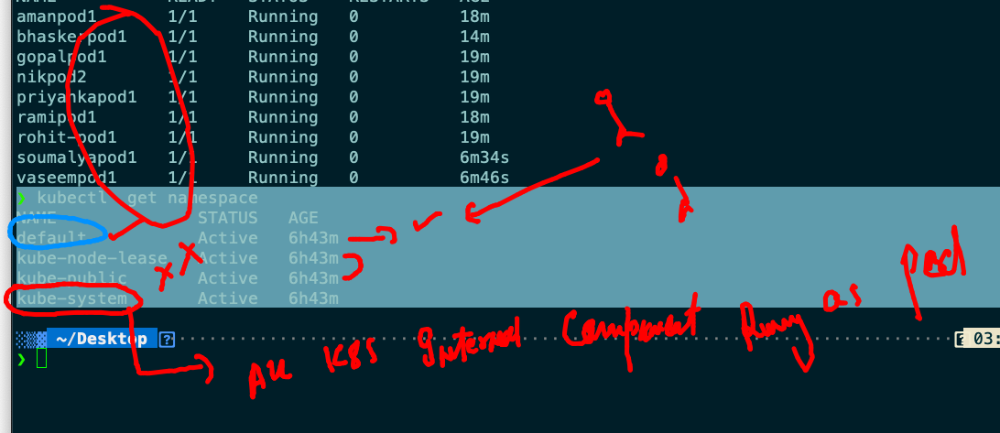

# oracle13thsept2021

## training plan 


## Revision of 2 days 


## Intro to docker. compose 


## more about docker compose 


## Installing docker-compose on CLient side 

[Install](https://docs.docker.com/compose/install/)

### checking installation 

```
[ashu@ip-172-31-5-127 myimages]$ docker-compose -v
docker-compose version 1.29.2, build 5becea4c

```

## Compose example 1 

```
[ashu@ip-172-31-5-127 myimages]$ ls
ashucompose  customer1  pythonapp  ubuntuimg  webapp
[ashu@ip-172-31-5-127 myimages]$ cd  ashucompose/
[ashu@ip-172-31-5-127 ashucompose]$ ls
docker-compose.yaml
[ashu@ip-172-31-5-127 ashucompose]$ docker-compose up  -d  
Creating network "ashucompose_default" with the default driver
Pulling ashuapp1 (alpine:)...
latest: Pulling from library/alpine
a0d0a0d46f8b: Downloading [>                                                  ]   41.3kB/2.814Ma0d0a0d46f8b: Pull complete
Digest: sha256:e1c082e3d3c45cccac829840a25941e679c25d438cc8412c2fa221cf1a824e6a
Status: Downloaded newer image for alpine:latest
Creating ashuc1 ... done

```

### more compose operations 

```
[ashu@ip-172-31-5-127 ashucompose]$ docker-compose ps 
 Name      Command     State   Ports
------------------------------------
ashuc1   ping fb.com   Up      

```

### 

```
[ashu@ip-172-31-5-127 ashucompose]$ docker-compose  stop 
Stopping ashuc1 ... done
[ashu@ip-172-31-5-127 ashucompose]$ docker-compose  ps
 Name      Command      State     Ports
---------------------------------------
ashuc1   ping fb.com   Exit 137        
[ashu@ip-172-31-5-127 ashucompose]$ docker-compose  start
Starting ashuapp1 ... done
[ashu@ip-172-31-5-127 ashucompose]$ docker-compose  ps
 Name      Command     State   Ports
------------------------------------
ashuc1   ping fb.com   Up           
[ashu@ip-172-31-5-127 ashucompose]$ docker-compose  kill
Killing ashuc1 ... done
[ashu@ip-172-31-5-127 ashucompose]$ docker-compose  start
Starting ashuapp1 ... done

```

### removing all 

```
[ashu@ip-172-31-5-127 ashucompose]$ docker-compose down 
Stopping ashuc1 ... done
Removing ashuc1 ... done
Removing network ashucompose_default

```

### Compsoe with diff file name 

```
351  docker-compose -f  two-container.yaml up -d
  352  docker-compose -f  two-container.yaml ps
  353  docker-compose -f  two-container.yaml stop
  354  docker-compose -f  two-container.yaml  down
  355  history 
  
```

### build docker. image everytime 

```
docker-compose -f  imagebuild.yaml  up -d --build 

```

## Problem with Container Engine 


## kubernetes as container orchestration engine 


### k8s arch 

### Level 1 


##  kube-apiserver 


### kube-schedular. 


### etcd 


### kube-controller-manager


### setting up cluster with minikube on local laptop 


### Minikube version 

```
❯ minikube  version
minikube version: v1.22.0
commit: a03fbcf166e6f74ef224d4a63be4277d017bb62e

```

### cluster done 

```
❯ minikube  version
minikube version: v1.22.0
commit: a03fbcf166e6f74ef224d4a63be4277d017bb62e
❯ minikube  start  --driver=docker
😄  minikube v1.22.0 on Darwin 11.4
🎉  minikube 1.23.0 is available! Download it: https://github.com/kubernetes/minikube/releases/tag/v1.23.0
💡  To disable this notice, run: 'minikube config set WantUpdateNotification false'

✨  Using the docker driver based on user configuration
👍  Starting control plane node minikube in cluster minikube
🚜  Pulling base image ...
🔥  Creating docker container (CPUs=2, Memory=1988MB) ...
🐳  Preparing Kubernetes v1.21.2 on Docker 20.10.7 ...
    ▪ Generating certificates and keys ...
    ▪ Booting up control plane ...
    ▪ Configuring RBAC rules ...
🔎  Verifying Kubernetes components...
    ▪ Using image gcr.io/k8s-minikube/storage-provisioner:v5
🌟  Enabled addons: storage-provisioner, default-storageclass
🏄  Done! kubectl is now configured to use "minikube" cluster and "default" namespace by default


```

### checking cluster 

```
❯ minikube  status
minikube
type: Control Plane
host: Running
kubelet: Running
apiserver: Running
kubeconfig: Configured

```

### connecting k8s cluster using client software called kubectl 

```
❯ kubectl   get  nodes
NAME       STATUS   ROLES                  AGE    VERSION
minikube   Ready    control-plane,master   8m6s   v1.21.2

```

### minikube stop 

```
❯ minikube stop
✋  Stopping node "minikube"  ...
🛑  Powering off "minikube" via SSH ...
🛑  1 nodes stopped.
❯ 
❯ kubectl   get  nodes
The connection to the server localhost:8080 was refused - did you specify the right host or port?

```

### on k8s master side there is an authentication file 

```
[root@masternode ~]# cd /etc/kubernetes/
[root@masternode kubernetes]# ls
admin.conf 

```


### sharing file to k8s clients

### connecting  cluster

```
kubectl   get   nodes  --kubeconfig  admin.conf
NAME         STATUS   ROLES                  AGE     VERSION
masternode   Ready    control-plane,master   4h20m   v1.22.1
minion1      Ready    <none>                 4h20m   v1.22.1
minion2      Ready    <none>                 4h20m   v1.22.1

```

### more client commands 

```
❯ kubectl  cluster-info
Kubernetes control plane is running at https://52.0.159.165:6443
CoreDNS is running at https://52.0.159.165:6443/api/v1/namespaces/kube-system/services/kube-dns:dns/proxy

To further debug and diagnose cluster problems, use 'kubectl cluster-info dump'.

```

## kubernetes pod introduction 


## More info about POD 


### checking yaml file syntax 

```
❯ kubectl  apply -f  ashupod1.yaml --dry-run=client
pod/ashupod-1 created (dry run)

```

### running pod 

```
❯ kubectl  apply -f  ashupod1.yaml --dry-run=client
pod/ashupod-1 created (dry run)
❯ kubectl  apply -f  ashupod1.yaml
pod/ashupod-1 created
❯ kubectl  get  pods
NAME           READY   STATUS    RESTARTS   AGE
ashupod-1      1/1     Running   0          8s
samanyupod-1   1/1     Running   0          7s

```

### checking pod node 

```
❯ kubectl  get  po  ashupod-1  -o wide
NAME        READY   STATUS    RESTARTS   AGE     IP                NODE      NOMINATED NODE   READINESS GATES
ashupod-1   1/1     Running   0          3m12s   192.168.179.194   minion2   <none>           <none>

```

### checking output of pod 

```
 kubectl   logs  -f  ashupod-1 
 
```

### kubectl immediately access of container

```
❯ kubectl  exec -it ashupod-1  -- sh
/ # 
/ # 
/ # ls
bin    dev    etc    home   lib    media  mnt    opt    proc   root   run    sbin   srv    sys    tmp    usr    var
/ # cat /etc/os-release 
NAME="Alpine Linux"
ID=alpine
VERSION_ID=3.14.2
PRETTY_NAME="Alpine Linux v3.14"
HOME_URL="https://alpinelinux.org/"
BUG_REPORT_URL="https://bugs.alpinelinux.org/"
/ # exit

```

### deleting pod

```
❯ kubectl delete pod  ashupod-1
pod "ashupod-1" deleted


```

###

```
❯ kubectl  delete  pods --all
pod "amanpod-1" deleted
pod "gopalpod-1" deleted
pod "nikpod-1" deleted
pod "rami-1" deleted
pod "rohitpod-1" deleted
pod "samanyupod-1" deleted

```

```
❯ kubectl  run  ashupod2  --image=alpine  --command ping fb.com --dry-run=client -o yaml
apiVersion: v1
kind: Pod
metadata:
  creationTimestamp: null
  labels:
    run: ashupod2
  name: ashupod2
spec:
  containers:
  - command:
    - ping
    - fb.com
    image: alpine
    name: ashupod2
    resources: {}
  dnsPolicy: ClusterFirst
  restartPolicy: Always
status: {}
❯ kubectl  run  ashupod2  --image=alpine  --command ping fb.com --dry-run=client -o yaml  >pod22.yaml


```

## Namespace 


## default namespaces in k8s 

```
❯ kubectl  get namespace
NAME              STATUS   AGE
default           Active   6h43m
kube-node-lease   Active   6h43m
kube-public       Active   6h43m
kube-system       Active   6h43m

```

### namespace details 



### to check pod internal details like , Namespace , container , process  , security and node info 

```
 kubectl  describe pod  amanpod1
Name:         amanpod1
Namespace:    default
Priority:     0
Node:         minion1/172.31.23.172
Start Time:   Wed, 15 Sep 2021 14:51:13 +0530
Labels:       run=amanpod1
Annotations:  cni.projectcalico.org/containerID: 194ad90da4220f8c4849233c1fb73714c3a8ffbc3ef2dab60e382cff5de0ce97
              cni.projectcalico.org/podIP: 192.168.34.13/32
              cni.projectcalico.org/podIPs: 192.168.34.13/32
Status:       Running
IP:           192.168.34.13
IPs:
  IP:  192.168.34.13
Containers:
  amanpod1:
    Container ID:  docker://bdbdb7d72a556cc93bf36ec2dd6895809c34435aba0584001e7e6ec5023c6915
    Image:         busybox
    Image ID:      docker-pullable://busybox@sha256:52f73a0a43a16cf37cd0720c90887ce972fe60ee06a687ee71fb93a7ca601df7
    Port:          <none>
    Host Port:     <none>
    Command:
      ping
      fb.com


```

### creating namesapce 

```
❯ kubectl   create  namespace  ashu-space
namespace/ashu-space created
❯ kubectl  get  ns
NAME              STATUS   AGE
ashu-space        Active   22s
default           Active   6h50m
kube-node-lease   Active   6h50m

```

### setting default namespace 

```
❯ kubectl  config set-context --current --namespace=ashu-space
Context "kubernetes-admin@kubernetes" modified.
❯ 
❯ kubectl  get   pods
No resources found in ashu-space namespace.
❯ kubectl  config  get-contexts
CURRENT   NAME                          CLUSTER      AUTHINFO           NAMESPACE
*         kubernetes-admin@kubernetes   kubernetes   kubernetes-admin   ashu-space


```

### all pod in any namespace can connect to each other using their IP address

```
❯ kubectl  get  po -o wide
NAME       READY   STATUS    RESTARTS   AGE    IP                NODE      NOMINATED NODE   READINESS GATES
ashupod2   1/1     Running   0          9m7s   192.168.179.218   minion2   <none>           <none>
❯ 
❯ 
❯ kubectl  get  po -o wide  -n default
NAME      READY   STATUS    RESTARTS   AGE     IP                NODE      NOMINATED NODE   READINESS GATES
nikpod1   1/1     Running   0          6m42s   192.168.179.223   minion2   <none>           <none>
❯ kubectl  exec -it ashupod2  -- sh
/ # ifconfig 
eth0      Link encap:Ethernet  HWaddr C6:E1:A0:CA:6D:51  
          inet addr:192.168.179.218  Bcast:192.168.179.218  Mask:255.255.255.255
          UP BROADCAST RUNNING MULTICAST  MTU:8981  Metric:1
          RX packets:617 errors:0 dropped:0 overruns:0 frame:0
          TX packets:613 errors:0 dropped:0 overruns:0 carrier:0
          collisions:0 txqueuelen:0 
          RX bytes:59310 (57.9 KiB)  TX bytes:58166 (56.8 KiB)

lo        Link encap:Local Loopback  
          inet addr:127.0.0.1  Mask:255.0.0.0
          UP LOOPBACK RUNNING  MTU:65536  Metric:1
          RX packets:0 errors:0 dropped:0 overruns:0 frame:0
          TX packets:0 errors:0 dropped:0 overruns:0 carrier:0
          collisions:0 txqueuelen:1000 
          RX bytes:0 (0.0 B)  TX bytes:0 (0.0 B)

/ # ping  192.168.179.223
PING 192.168.179.223 (192.168.179.223): 56 data bytes
64 bytes from 192.168.179.223: seq=0 ttl=254 time=0.096 ms
64 bytes from 192.168.179.223: seq=1 ttl=254 time=0.164 ms
64 bytes from 192.168.179.223: seq=2 ttl=254 time=0.114 ms
64 bytes from 192.168.179.223: seq=3 ttl=254 time=0.119 ms
^C
--- 192.168.179.223 ping statistics ---
4 packets transmitted, 4 packets received, 0% packet loss
round-trip min/avg/max = 0.096/0.123/0.164 ms
/ # 

```

### Pod Networking 

### CNI introduction 


## all pods can communicate to each other


### POd nginx creating 

```
❯ kubectl   run  ashuwebpod  --image=nginx  --port 80 --dry-run=client -o yaml
apiVersion: v1
kind: Pod
metadata:
  creationTimestamp: null
  labels:
    run: ashuwebpod
  name: ashuwebpod
spec:
  containers:
  - image: nginx
    name: ashuwebpod
    ports:
    - containerPort: 80
    resources: {}
  dnsPolicy: ClusterFirst
  restartPolicy: Always
status: {}
❯ kubectl   run  ashuwebpod  --image=nginx  --port 80 --dry-run=client -o yaml  >nginx.yaml

```

### nginx pod deployment 

```
shupod1.yaml nginx.yaml    pod22.yaml
❯ kubectl  apply -f nginx.yaml
pod/ashuwebpod created
❯ kubectl  get  po -o wide
NAME         READY   STATUS              RESTARTS   AGE   IP                NODE      NOMINATED NODE   READINESS GATES
ashupod2     1/1     Running             0          24m   192.168.179.218   minion2   <none>           <none>
ashuwebpod   0/1     ContainerCreating   0          6s    <none>            minion1   <none>           <none>
❯ kubectl  get  po -o wide
NAME         READY   STATUS    RESTARTS   AGE   IP                NODE      NOMINATED NODE   READINESS GATES
ashupod2     1/1     Running   0          24m   192.168.179.218   minion2   <none>           <none>
ashuwebpod   1/1     Running   0          17s   192.168.34.20     minion1   <none>           <none>

```

### access pod app from client machine 

```
 kubectl   port-forward  ashuwebpod  1234:80
Forwarding from 127.0.0.1:1234 -> 80
Forwarding from [::1]:1234 -> 80
Handling connection for 1234
Handling connection for 1234

```


